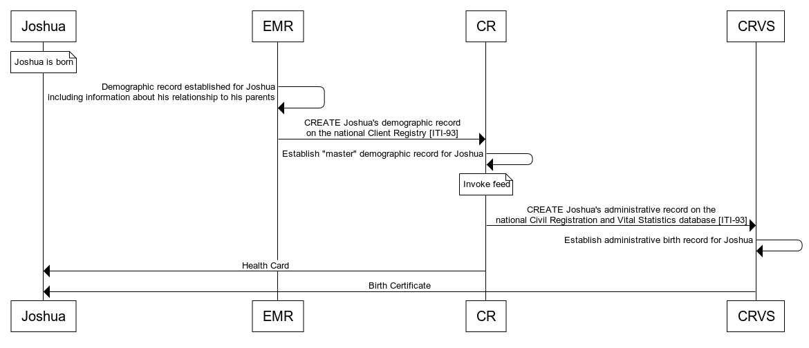
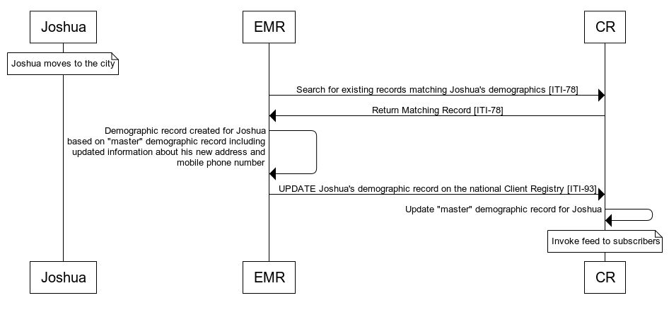
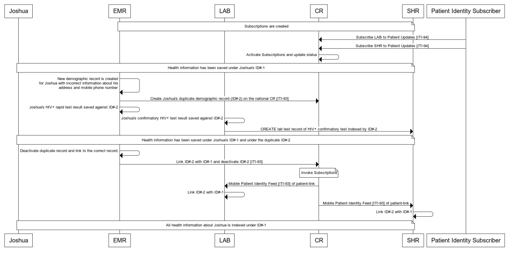

**Integrating the Healthcare Enterprise**

**IHE IT Infrastructure**

**Technical Framework Supplement**

**Patient Master Identity Registry**

**(PMIR)**

HL7® FHIR® R4

Using Resources at FMM Level 2-N

**Revision 1.3 – Trial Implementation**

Date: December 11, 2020

Author: ITI Technical Committee

Email: iti@ihe.net

**Please verify you have the most recent version of this document.** See
[here](http://ihe.net/Technical_Frameworks/)
for Trial Implementation and Final Text versions and
[here](http://ihe.net/Public_Comment/)
for Public Comment versions.

**Foreword**

This is a supplement to the IHE IT Infrastructure Technical Framework
V17.0. Each supplement undergoes a process of public comment and trial
implementation before being incorporated into the volumes of the
Technical Frameworks.

This supplement is published on December 11, 2020 for trial
implementation and may be available for testing at subsequent IHE
Connectathons. The supplement may be amended based on the results of
testing. Following successful testing it will be incorporated into the
IT Infrastructure Technical Framework. Comments are invited and may be
submitted at
[http://www.ihe.net/ITI\_Public\_Comments](http://www.ihe.net/ITI_Public_Comments/).

This supplement describes changes to the existing technical framework
documents.

“Boxed” instructions like the sample below indicate to the Volume Editor
how to integrate the relevant section(s) into the relevant Technical
Framework volume.

Amend Section X.X by the following:

Where the amendment adds text, make the added text
**bold underline**. Where the amendment
removes text, make the removed text **~~bold strikethrough~~**. When
entire new sections are added, introduce with editor’s instructions to
“add new text” or similar, which for readability are not bolded or
underlined.

General information about IHE can be found at
[http://ihe.net](http://ihe.net/).

Information about the IHE IT Infrastructure domain can be found at
[http://ihe.net/IHE\_Domains](http://ihe.net/IHE_Domains/).

Information about the organization of IHE Technical Frameworks and
Supplements and the process used to create them can be found at
[http://ihe.net/IHE\_Process](http://ihe.net/IHE_Process/) and
[http://ihe.net/Profiles](http://ihe.net/Profiles/).

The current version of the IHE IT Infrastructure Technical Framework can
be found at
[http://ihe.net/Technical\_Frameworks](http://ihe.net/Technical_Frameworks/).

**CONTENTS**

[Introduction to this Supplement 6](#introduction-to-this-supplement)

[Open Issues and Questions 8](#open-issues-and-questions)

[Closed Issues 8](#closed-issues)

[IHE Technical Frameworks General Introduction
10](#ihe-technical-frameworks-general-introduction)

[9 Copyright Licenses 10](#copyright-licenses)

[9.1 Copyright of Base Standards 10](#copyright-of-base-standards)

[**9.1.1 DICOM (Digital Imaging and Communications in Medicine)**
10](#dicom-digital-imaging-and-communications-in-medicine)

[**9.1.2 HL7 (Health Level Seven)** 10](#hl7-health-level-seven)

[**9.1.3 LOINC (Logical Observation Identifiers Names and Codes)**
10](#loinc-logical-observation-identifiers-names-and-codes)

[**9.1.4 SNOMED CT (Systematized Nomenclature of Medicine -- Clinical
Terms)**
11](#snomed-ct-systematized-nomenclature-of-medicine----clinical-terms)

[10 Trademark 11](#trademark)

[IHE Technical Frameworks General Introduction Appendices
12](#ihe-technical-frameworks-general-introduction-appendices)

[Appendix A – Actor Summary Definitions 12](#_Toc58501350)

[Appendix B – Transaction Summary Definitions 12](#_Toc58501351)

[Appendix D – Glossary 13](#_Toc58501352)

[Volume 1 – Profiles 14](#_1y810tw)

[49 Patient Master Identity Registry (PMIR) Profile
14](#patient-master-identity-registry-pmir-profile)

[49.1 PMIR Actors, Transactions, and Content Modules
15](#pmir-actors-transactions-and-content-modules)

[49.1.1 Actor Descriptions and Actor Profile Requirements
16](#actor-descriptions-and-actor-profile-requirements)

[49.1.1.1 Patient Identity Registry 16](#patient-identity-registry)

[49.1.1.2 Patient Identity Source 17](#patient-identity-source)

[49.2 PMIR Actor Options 17](#pmir-actor-options)

[49.3 PMIR Required Actor Groupings 17](#pmir-required-actor-groupings)

[49.4 PMIR Overview 18](#pmir-overview)

[49.4.1 Intentionally Left Blank 18](#intentionally-left-blank)

[49.4.2 Use Cases 18](#use-cases)

[49.4.2.1 Use Case \#1: Lookup Patient Identity
18](#use-case-1-lookup-patient-identity)

[49.4.2.1.1 Lookup Patient Identity Use Case Description
18](#lookup-patient-identity-use-case-description)

[49.4.2.2 Use Case \#2: Create Patient Identity
18](#use-case-2-create-patient-identity)

[49.4.2.2.1 Create Patient Identity Use Case Description
18](#create-patient-identity-use-case-description)

[49.4.2.2.2 Create Patient Identity Process Flow
19](#create-patient-identity-process-flow)

[49.4.2.3 Use Case \#3: Update Patient Identity
20](#use-case-3-update-patient-identity)

[49.4.2.3.1 Update Patient Identity Use Case Description
20](#update-patient-identity-use-case-description)

[49.4.2.3.2 Update Patient Identity Process Flow
20](#update-patient-identity-process-flow)

[49.4.2.4 Use Case \#4: Merge Patient Identities
21](#use-case-4-merge-patient-identities)

[49.4.2.4.1 Merge Patient Identities Use Case Description
21](#merge-patient-identities-use-case-description)

[49.4.2.4.2 Merge Patient Identities Process Flow
22](#merge-patient-identities-process-flow)

[49.5 PMIR Security Considerations 24](#pmir-security-considerations)

[49.6 PMIR Cross Profile Considerations
24](#pmir-cross-profile-considerations)

[**Volume 1 Appendices 25**](#_2w5ecyt)

[**Volume 2 – Transactions 26**](#_1yyy98l)

[3.93 Mobile Patient Identity Feed \[ITI-93\]
26](#mobile-patient-identity-feed-iti-93)

[3.93.1 Scope 26](#scope)

[3.93.2 Actor Roles 26](#actor-roles)

[3.93.3 Referenced Standards 26](#referenced-standards)

[3.93.4 Messages 27](#messages)

[3.93.4.1 Mobile Patient Identity Feed Request Message
27](#mobile-patient-identity-feed-request-message)

[3.93.4.1.1 Trigger Events 27](#trigger-events)

[3.93.4.1.2 Message Semantics 27](#message-semantics)

[3.93.4.1.2.1 FHIR Message Bundle Resource Constraints
28](#fhir-message-bundle-resource-constraints)

[3.93.4.1.2.2 FHIR MessageHeader Resource Constraints
28](#fhir-messageheader-resource-constraints)

[3.93.4.1.2.3 FHIR History Bundle Resource Constraints
29](#fhir-history-bundle-resource-constraints)

[3.93.4.1.2.4 FHIR History Bundle entry Constraints for Merge
30](#fhir-history-bundle-entry-constraints-for-merge)

[3.93.4.1.2.5 FHIR Patient Resource Constraints for Related Person
30](#fhir-patient-resource-constraints-for-related-person)

[3.93.4.1.2.6 Example FHIR Bundle Excerpt for a Merge
31](#example-fhir-bundle-excerpt-for-a-merge)

[3.93.4.1.3 Expected Actions 33](#expected-actions)

[*3.93.4.1.3.1* Post Merge/Delete Expectations
33](#post-mergedelete-expectations)

[3.93.4.2 Mobile Patient Identity Feed Response
34](#mobile-patient-identity-feed-response)

[3.93.4.2.1 Trigger Events 34](#trigger-events-1)

[3.93.4.2.2 Message Semantics 34](#message-semantics-1)

[3.93.4.2.3 Expected Actions 34](#expected-actions-1)

[3.93.5 Security Considerations 34](#security-considerations)

[3.93.5.1 Security Audit Considerations
34](#security-audit-considerations)

[3.93.5.1.1 Supplier audit message: 35](#supplier-audit-message)

[3.93.5.1.2 Consumer audit message: 36](#consumer-audit-message)

[3.94 Subscribe to Patient Updates \[ITI-94\]
38](#subscribe-to-patient-updates-iti-94)

[3.94.1 Scope 38](#scope-1)

[3.94.2 Actor Roles 38](#actor-roles-1)

[3.94.3 Referenced Standards 38](#referenced-standards-1)

[3.94.4 Messages 38](#messages-1)

[3.94.4.1 Subscribe to Patient Updates Request Message
39](#subscribe-to-patient-updates-request-message)

[3.94.4.1.1 Trigger Events 39](#trigger-events-2)

[3.94.4.1.2 Message Semantics 39](#message-semantics-2)

[3.94.4.1.2.1 FHIR Subscription Resource Constraints
40](#fhir-subscription-resource-constraints)

[3.94.4.1.2.1.1 Criteria Constraints 40](#criteria-constraints)

[3.94.4.1.3 Expected Actions 41](#expected-actions-2)

[3.94.4.2 Subscribe to Patient Updates Response
41](#subscribe-to-patient-updates-response)

[3.94.4.2.1 Trigger Events 41](#trigger-events-3)

[3.94.4.2.2 Message Semantics 41](#message-semantics-3)

[3.94.4.2.3 Expected Actions 42](#expected-actions-3)

[3.94.4.3 Get Patient Subscription Request/Response Message
42](#get-patient-subscription-requestresponse-message)

[3.94.4.4 Enable/Disable Patient Subscription Request/Response Message
42](#enabledisable-patient-subscription-requestresponse-message)

[3.94.4.5 Delete Patient Subscription Request/Response Message
42](#delete-patient-subscription-requestresponse-message)

[3.94.5 Security Considerations 42](#security-considerations-1)

[3.94.5.1 Security Audit Considerations
43](#security-audit-considerations-1)

[3.94.5.1.1 Patient Identity Subscriber audit message:
43](#patient-identity-subscriber-audit-message)

[3.94.5.1.2 Patient Identity Registry audit message:
45](#patient-identity-registry-audit-message)

[3.78.2 Actor Roles 46](#actor-roles-2)

[3.83.2 Actor Roles 47](#actor-roles-3)

#   
Introduction to this Supplement

<table>
<tbody>
<tr class="odd">
<td>
Whenever possible, IHE profiles are based on established and stable underlying standards. However, if an IHE domain determines that an emerging standard has high likelihood of industry adoption, and the standard offers significant benefits for the use cases it is attempting to address, the domain may develop IHE profiles based on such a standard. During Trial Implementation, the IHE domain will update and republish the IHE profile as the underlying standard evolves.

Product implementations and site deployments may need to be updated in order for them to remain interoperable and conformant with an updated IHE profile.

This PMIR Profile incorporates content from Release 4 of the HL7® FHIR® standard. HL7 describes FHIR Change Management and Versioning at <a href="https://www.hl7.org/fhir/versions.html">https://www.hl7.org/fhir/versions.html</a>.

HL7 provides a rating of the maturity of FHIR content based on the FHIR Maturity Model (FMM): level 0 (draft) through N (Normative). See http://hl7.org/fhir/versions.html#maturity.

The FMM levels for FHIR content used in this profile are:

<table>
<thead>
<tr class="header">
<th>FHIR Content</th>
<th>FMM Level</th>
</tr>
</thead>
<tbody>
<tr class="odd">
<td>Patient</td>
<td>N</td>
</tr>
<tr class="even">
<td>RelatedPerson</td>
<td>2</td>
</tr>
<tr class="odd">
<td>Bundle</td>
<td>N</td>
</tr>
<tr class="even">
<td>MessageHeader</td>
<td>4</td>
</tr>
<tr class="odd">
<td>Subscription</td>
<td>3</td>
</tr>
</tbody>
</table></td>
</tr>
</tbody>
</table>

The Patient Master Identity Registry (PMIR) Profile supports the
creating, updating and deprecating of patient master identity
information about a subject of care, as well as subscribing to changes
to the patient master identity, using the HL7 FHIR standard resources
and RESTful transactions. In PMIR, “patient identity” information
includes all information found in the FHIR Patient Resource such as
identifier, name, phone, gender, birth date, address, marital status,
photo, others to contact, preference for language, general practitioner,
and links to other instances of identities. The “patient master
identity” is the dominant patient identity managed centrally among
many participating organizations (a.k.a., “Golden Patient Identity”).

Beyond the basic create, retrieve, update, and delete transaction set,
this profile addresses important patient safety issues related to cases
where there are two or more patient master identities that have been
established for the same person, thus it is not clear which identity is
the “true” one. There is also a risk that health data (possibly
conflicting) may be associated with each identity – and these disparate
data, together, may need to be reconciled before a fully and accurate
“health picture” can be developed for this person. These situations
represent patient safety risks. This profile addresses how these
multiple patient master identities can be merged into a single patient
master identity, and how this merge flows down to data custodians so
that they take appropriate actions. It is outside the scope of this
profile to define how references to the deprecated patient master
identity from other data should be handled.

This profile is intended for FHIR-only configurations without other
underlying standards for patient master identity management. The FHIR
message pattern was chosen because it fits well into the subscription
notification model.

## Open Issues and Questions

**PMIR-1:** HL7 Patient Administration workgroup is looking at better
defining the patient merge/link functionality in FHIR. We will follow
this work and collaborate with HL7 to keep these efforts aligned. See
<https://confluence.hl7.org/display/PA/Merge+Operation>

**PMIR-2:** Should we include shall, should, or may for Provenance
resources in the Mobile Patient Identity Feed transaction? This version
doesn’t provide any guidance on Provenance, should it?

**PMIR-6:** Should we include an option on the Patient Identity Registry
to support the FHIR $match operation on patients? This would require an
additional actor and transaction.

**PMIR-7:** IHE has submitted a Change Request
[GF\#23009](https://gforge.hl7.org/gf/project/fhir/tracker/?action=TrackerItemEdit&tracker_item_id=23009)
with HL7 to clarify their usage of link with RelatedPerson as
recommended in this profile to allow for management of parent
relationships to children.

**PMIR-8:** Should we require maintaining resource versioning
information when updates are made to resources?

**PMIR-9:** If other domain patient identities are included in the feed,
should there be expected actions on the Patient Identity Registry or
Patient Identity Consumer?

**PMIR-10:** The security for the feed transaction is currently being
debated in IHE and HL7. The mutual authentication solution in ATNA may
be used. The IUA solution with OAuth identities may be used. These
solutions aren’t straight-forward and resolution of IHE’s recommendation
requires trial implementation feedback.

**PMIR-11:** CP-ITI-1203 changed the name of a PMIR actor from “Patient
Identity Manager” to “Patient Identity Registry” to better reflect the
passive role that the actor plays in PMIR. There was a suggestion at
that time to change the name of the profile from “Patient Master
Identity Registry” to “Patient Master Identity Registration.” Should the
profile be renamed?

## Closed Issues

**PMIR-3:** Should Subscription be an option or required on the Patient
Identity Registry? Should the configurable feed destination be an option
or required for Patient Identity Registry?

*Subscription is required and there is no requirement for how a
configurable feed destination is handled.*

***PMIR-4:** There is a new profile work item in ITI that would bind
this profile and MHD into a FHIR based document sharing health
information exchange. That profile is Mobile Health Document Sharing
(MHDS).*

**PMIR-5:** In some profiles demographics is used to cover all
demographic information including identifiers. This profile uses
identity to cover demographics and identifiers. Which term is most clear
and should this profile use demographics instead of identity?

*We have used identity to cover both identifiers and demographics as
defined under the new glossary terms and in the Concepts section.*

#   
IHE Technical Frameworks General Introduction

The [IHE Technical Framework General
Introduction](http://ihe.net/Technical_Frameworks/#GenIntro) is shared
by all of the IHE domain technical frameworks. Each technical framework
volume contains links to this document where appropriate.

# 9 Copyright Licenses

IHE International hereby grants to each Member Organization, and to any
other user of these documents, an irrevocable, worldwide, perpetual,
royalty-free, nontransferable, nonexclusive, non-sublicensable license
under its copyrights in any IHE profiles and Technical Framework
documents, as well as any additional copyrighted materials that will be
owned by IHE International and will be made available for use by Member
Organizations, to reproduce and distribute (in any and all print,
electronic or other means of reproduction, storage or transmission) such
IHE Technical Documents.

The licenses covered by this Copyright License are only to those
copyrights owned or controlled by IHE International itself. If parts of
the Technical Framework are included in products that also include
materials owned or controlled by other parties, licenses to use those
products are beyond the scope of this IHE document and would have to be
obtained from that other party.

## 9.1 Copyright of Base Standards

IHE technical documents refer to and make use of a number of standards
developed and published by several standards development organizations.
All rights for their respective base standards are reserved by these
organizations. This agreement does not supersede any copyright
provisions applicable to such base standards. Copyright license
information for frequently referenced base standards is provided below.

### **9.1.1 DICOM (Digital Imaging and Communications in Medicine)**

DICOM® is the registered trademark of the National Electrical
Manufacturers Association for its standards publications relating to
digital communications of medical information.

### **9.1.2 HL7 (Health Level Seven)**

HL7®, Health Level Seven®, CDA®, and
FHIR® are registered trademarks of Health Level Seven
International.

Health Level Seven, Inc. has granted permission to IHE to reproduce
tables from the HL7 standard. The HL7 tables in this document are
copyrighted by Health Level Seven, Inc. All rights reserved. Material
drawn from these documents is credited where used.

### **9.1.3 LOINC (Logical Observation Identifiers Names and Codes)**

LOINC® is registered United States trademarks of Regenstrief
Institute, Inc.

### **9.1.4 SNOMED CT (Systematized Nomenclature of Medicine -- Clinical Terms)**

Some IHE Profiles incorporate SNOMED® CT, which is used by
permission of the International Health Terminology Standards Development
Organisation. SNOMED CT© was originally created by the
College of American Pathologists. SNOMED CT is a registered trademark of
the International Health Terminology Standards Development Organisation,
all rights reserved.

# 10 Trademark

IHE® and the IHE logo are trademarks of the Healthcare
Information Management Systems Society in the United States and
trademarks of IHE Europe in the European Community. They may only be
used with the written consent of the IHE International Board Operations
Committee, which may be given to a Member Organization in broad terms
for any use that is consistent with the IHE mission and operating
principles.

# IHE Technical Frameworks General Introduction Appendices

The [IHE Technical Framework General Introduction
Appendices](http://ihe.net/Technical_Frameworks/#GenIntro) are
components shared by all of the IHE domain technical frameworks. Each
technical framework volume contains links to these documents where
appropriate.

Update the following appendices to the General Introduction as indicated
below. Note that these are **not** appendices to this domain’s Technical
Framework (TF-1, TF-2, TF-3 or TF-4) but rather, they are appendices to
the IHE Technical Frameworks General Introduction located
[here](https://www.ihe.net/resources/technical_frameworks/#GenIntro).

# Appendix A – Actor Summary Definitions

*Add the following new or modified actors to the IHE Technical
Frameworks General Introduction Appendix A:*

|                             |                                                                                                                                                            |
| --------------------------- | ---------------------------------------------------------------------------------------------------------------------------------------------------------- |
| Actor Name                  | Definition                                                                                                                                                 |
| Patient Identity Registry   | Receives patient identity updates, manages patient master identities, sends changes, and provides a searchable repository of patient identity information. |
| Patient Identity Subscriber | Sends subscription requests for patient identity updates ~~to be sent to a Patient Identity Consumer~~.                                                    |
| Patient Identity Consumer   | Receives patient identity updates.                                                                                                                         |

# Appendix B – Transaction Summary Definitions

Add the following new or modified transactions to the IHE Technical
Frameworks General Introduction Appendix B:

|                                         |                                                                                                         |
| --------------------------------------- | ------------------------------------------------------------------------------------------------------- |
| Transaction Name and Number             | Definition                                                                                              |
| Mobile Patient Identity Feed \[ITI-93\] | Notifications of all events related to patient identities (creation, update, link, etc.).               |
| Subscribe to Patient Updates \[ITI-94\] | Subscription to notifications about events impacting patient identities (creation, update, link, etc.). |

# Appendix D – Glossary

Add the following **new o**r modified glossary terms to the IHE
Technical Frameworks General Introduction Appendix D.

No additions to the general glossary for the IHE Technical Framework.

Volume 1 – Profiles

Add new Section 49

# 49 Patient Master Identity Registry (PMIR) Profile

The Patient Master Identity Registry (PMIR) Profile is intended for use
in an environment where each patient has a single “Golden Patient
record”, such as in Low and Middle Income Countries (LMIC) or in
Organization for Economic Cooperation and Development (OECD) settings.
PMIR supports creating, updating, and deprecating patient identity
information about a subject of care, as well as subscribing to changes,
using HL7 FHIR resources and RESTful transactions.

**PMIR Concepts and Defined Terms:**

In PMIR, a patient has a single “Patient Master Identity” (a.k.a. Golden
Patient record) that is comprised of identifying information, such as
business identifiers, name, phone, gender, birth date, address, marital
status, photo, contacts, preference for language, and links to other
patient identities (e.g., a mother’s identity linked to a newborn).

A “Master Patient Identification Domain" is a collection of Patient
Master Identities shared among a set of PMIR Patient Identity Source and
Patient Identity Consumer Actors using the services of a single Patient
Identity Registry.

A patient’s Patient Master Identity is managed by the Patient Identity
Sources in the domain according to policies and business rules that
determine when those Sources create, update, or delete a Patient Master
Identity, or merge two Patient Master Identities in the Registry. The
policies may include authorization needed for a Patient Identity
Consumer to access Patient Master Identities. These policies vary by
domain and are not constrained by this profile.

PMIR also enables resolution of cases where two or more Patient Master
Identities have mistakenly been established for the same person. There
is a patient safety risk that health data (possibly conflicting) may be
associated with each identity, and these disparate data may need to be
reconciled. This profile addresses how these multiple Patient Master
Identities can be merged into a single Patient Master Identity, and how
this merge flows down to data custodians so that they take appropriate
actions. It is outside the scope of this profile to define how
references from other data to a subsumed Patient Master Identity should
be handled. Other IHE profiles, such as Mobile Health Document Sharing
(MHDS), address these requirements.

## 49.1 PMIR Actors, Transactions, and Content Modules

This section defines the actors, transactions, and/or content modules in
this profile. General definitions of actors are given in the Technical
Frameworks General Introduction Appendix A. IHE Transactions can be
found in the Technical Frameworks General Introduction Appendix B. Both
appendices are located at
[http://ihe.net/Technical\_Frameworks/\#GenIntro](http://ihe.net/Technical_Frameworks/#GenIntro)

Figure 49.1-1 shows the actors directly involved in the PMIR Profile and
the relevant transactions between them.

Figure 49.1-1: PMIR Actor Diagram

Table 49.1-1 lists the transactions for each actor directly involved in
the PMIR Profile. To claim compliance with this profile, an actor shall
support all required transactions (labeled “R”) and may support the
optional transactions (labeled “O”).

Table 49.1-1: PMIR Profile - Actors and Transactions

<table>
<tbody>
<tr class="odd">
<td>Actors</td>
<td>Transactions</td>
<td>Initiator or Responder</td>
<td>Optionality</td>
<td>Reference</td>
</tr>
<tr class="even">
<td>Patient Identity Source</td>
<td>Mobile Patient Identity Feed [ITI-93]</td>
<td>Initiator</td>
<td>R</td>
<td>ITI TF-2: 3.93</td>
</tr>
<tr class="odd">
<td>Patient Identity Consumer</td>
<td>Mobile Patient Identity Feed [ITI-93]</td>
<td>Responder</td>
<td>R</td>
<td>ITI TF-2: 3.93</td>
</tr>
<tr class="even">
<td>Patient Identity Registry</td>
<td>Mobile Patient Identity Feed [ITI-93]</td>
<td>Initiator and Responder</td>
<td>R</td>
<td>ITI TF-2: 3.93</td>
</tr>
<tr class="odd">
<td></td>
<td>Mobile Patient Identifier Cross-reference Query [ITI-83]</td>
<td>Responder</td>
<td>R</td>
<td>
ITI TF-2: 3.83

(Note 1)
</td>
</tr>
<tr class="even">
<td></td>
<td>Mobile Patient Demographics Query [ITI-78]</td>
<td>Responder</td>
<td>R</td>
<td>
ITI TF-2: 3.78

(Note 2)
</td>
</tr>
<tr class="odd">
<td></td>
<td>Subscribe to Patient Updates [ITI-94]</td>
<td>Responder</td>
<td>R</td>
<td>ITI TF-2: 3.94</td>
</tr>
<tr class="even">
<td>Patient Demographics Consumer</td>
<td>Mobile Patient Demographics Query [ITI-78]</td>
<td>Initiator</td>
<td>R</td>
<td>ITI TF-2: 3.83</td>
</tr>
<tr class="odd">
<td>Patient Identifier Cross-reference Consumer</td>
<td>Mobile Patient Identifier Cross-reference Query [ITI-83]</td>
<td>Initiator</td>
<td>R</td>
<td>ITI TF-2: 3.83</td>
</tr>
<tr class="even">
<td>Patient Identity Subscriber</td>
<td>Subscribe to Patient Updates [ITI-94]</td>
<td>Initiator</td>
<td>R</td>
<td>ITI TF-2: 3.94</td>
</tr>
</tbody>
</table>

Note 1: The Patient Identity Registry shall respond to \[ITI-83\]
queries using the requirements in that transaction for the Patient
Identity Cross-Reference Manager.

Note 2: The Patient Identity Registry shall respond to \[ITI-78\]
queries using the requirements in that transaction for the Patient
Demographics Supplier.

### 49.1.1 Actor Descriptions and Actor Profile Requirements

Most requirements are documented in ITI TF-2 Transactions. This section
documents additional requirements on the profile’s actors.

#### 49.1.1.1 Patient Identity Registry

In PMIR, there is one and only one Patient Identity Registry in a Master
Patient Identification Domain. The Patient Identity Registry is a
passive store for shared (or golden) identities that are under the
distributed control of Patient Identity Sources.

The Patient Identity Registry persists Patient Master Identities from
the Patient Identity Sources in the Master Patient Identification
Domain.

The Patient Identity Registry makes available the Patient Master
Identity for each patient in the Patient Identification Domain:

  - when responding to a Mobile Patient Demographics Query \[ITI-78\] or
    Mobile Patient Identifier Cross-reference Query \[ITI-83\]

  - when sending Mobile Patient Identity Feed \[ITI-93\] to a Patient
    Identity Consumer

#### 49.1.1.2 Patient Identity Source

Patient Identity Sources are responsible for the accuracy of Patient
Master Identities in the Patient Identity Registry.

All Patient Identity Source Actors in the Master Patient Identification
Domain shall apply the domain’s policies and business rules for
determining the accuracy of a patient’s Patient Master Identity and thus
when to use Mobile Patient Identity Feed \[ITI-93\] to initiate a
create, update, delete, or merge of Patient Master Identities. For
example, during a patient encounter, a Patient Identity Source may group
with a Patient Demographics Consumer to use PDQm Query \[ITI-78\] to
find the patient’s Patient Master Identity. If more than one Patient
Master Identity appears to refer to that same patient, it is the
responsibility of that Patient Identity Source to decide, based on
domain policy, whether it needs to initiate a merge of one of the
Patient Master Identities into a single surviving Patient Master
Identity.

## 49.2 PMIR Actor Options

Options that may be selected for each actor in this profile, if any, are
listed in the Table 49.2-1. Dependencies between options, when
applicable, are specified in notes.

Table 49.2-1: PMIR – Actors and Options

|                                             |             |           |
| ------------------------------------------- | ----------- | --------- |
| Actor                                       | Option Name | Reference |
| Patient Identity Source                     | None        | \--       |
| Patient Identity Consumer                   | None        | \--       |
| Patient Identity Registry                   | None        | \--       |
| Patient Demographics Consumer               | None        | \--       |
| Patient Identifier Cross-reference Consumer | None        | \--       |
| Patient Identity Subscriber                 | None        | \--       |

## 49.3 PMIR Required Actor Groupings 

Table 49.3-1: PMIR Profile - Required Actor Groupings

|                                             |                             |           |                            |
| ------------------------------------------- | --------------------------- | --------- | -------------------------- |
| PMIR Actor                                  | Actor(s) to be grouped with | Reference | Content Bindings Reference |
| Patient Identity Source                     | None                        | \--       | \--                        |
| Patient Identity Consumer                   | None                        | \--       | *--*                       |
| Patient Identity Registry                   | None                        | \--       | *--*                       |
| Patient Demographics Consumer               | None                        | \--       | \--                        |
| Patient Identifier Cross-reference Consumer | None                        | \--       | \--                        |
| Patient Identity Subscriber                 | None                        | \--       | *--*                       |

## 49.4 PMIR Overview

### 49.4.1 Intentionally Left Blank

### 49.4.2 Use Cases

#### 49.4.2.1 Use Case \#1: Lookup Patient Identity

A client needs to lookup a patient master identity.

##### 49.4.2.1.1 Lookup Patient Identity Use Case Description

When a patient master identity is needed, a client uses a PIXm or PDQm
query; then a patient master identity will be returned.

#### 49.4.2.2 Use Case \#2: Create Patient Identity

A new client record is created in a demographic database.

##### 49.4.2.2.1 Create Patient Identity Use Case Description

Following a healthy pregnancy, Mosa gives birth to her new baby Joshua.
Information is captured about Joshua and about the relationship between
him and his parents in the care facility’s electronic medical records
(EMR) system. Leveraging the information in the EMR, a new patient
master identity record is created for baby Joshua in the Ministry of
Health’s (MOH) national client registry (CR).

Joshua’s patient master identity in the client registry establishes his
unique identity across the care delivery network operated under the
auspices of the MOH. Joshua’s data are also securely shared with the
Civil Registration and Vital Statistics (CRVS) database maintained by
the Ministry of Home Affairs in the country where Joshua was born. These
data are used to generate a birth certificate for Joshua.

Some days after Mosa and Joshua return home from the care facility,
Joshua’s health card and his birth certificate are delivered. Joshua now
has his unique master identifier for health purposes and his birth
certificate, which affords him a legal status in his country.

In Figure 49.4.2.2.2-1 below: The EMR acts as a Patient Identity Source.
The CR acts as the Patient Identity Registry. The CRVS acts as a Patient
Identity Consumer.

##### 49.4.2.2.2 Create Patient Identity Process Flow

Figure 49.4.2.2.2-1: Process Flow for the Create Patient Identity Use
Case

@startuml

participant Joshua

participant EMR

participant CR

participant CRVS

Note over Joshua: Joshua is born

EMR-\>EMR: Demographic record established for Joshua\\nincluding
information about his relationship to his parents

EMR-\>CR: CREATE Joshua's demographic record\\non the national Client
Registry \[ITI-93\]

CR-\>CR: Establish "master" demographic record for Joshua

Note over CR: Invoke feed

CR-\>CRVS: CREATE Joshua's administrative record on the\\nnational Civil
Registration and Vital Statistics database \[ITI-93\]

CRVS-\>CRVS: Establish administrative birth record for Joshua

CR-\>Joshua: Health Card

CRVS-\>Joshua: Birth Certificate

@enduml

Figure 49.4.2.2.2-2: Create Patient Identity Workflow Diagram Pseudocode

**Pre-conditions:**

Joshua is born at a care facility. The details about his name, his
gender, and his parental relationships are known. These are captured in
the care facility’s EMR. Since this is a birth and the first time the
record is entered in the EMR no queries are made to search for existing
records.

**Main Flow:**

Joshua’s information in the care facility’s EMR is communicated to the
MOH’s national Client Registry (CR). If the information is valid, the
patient identity will be created on the CR. Joshua’s information in the
CR is also communicated to the MOH’s national Civil Registration and
Vital Statistics (CRVS) database.

**Post-conditions:**

If the Create message was valid, his new patient master identity will be
established on the MOH’s CR and on the MOH’s CRVS. In time, Joshua will
receive his health card and his birth certificate.

#### 49.4.2.3 Use Case \#3: Update Patient Identity

An existing client identity is updated in an identity database.

##### 49.4.2.3.1 Update Patient Identity Use Case Description

Following a healthy childhood and after completing his schooling, Joshua
leaves home to start a new job in a nearby city. As part of starting his
new job at his new company, Joshua attends at a local community clinic
in the new city to obtain a physical check-up as part of the process to
become enrolled in the company’s health insurance plan.

Joshua’s identity details are created in the clinic’s EMR with his new
address and his new mobile phone number. The EMR searches the CR for
Joshua’s master patient identity and then updates the MOH CR with
Joshua’s updated identity details.

In Figure 49.4.2.3.2-1 below: The EMR acts as a Patient Identity
Supplier. The CR acts as the Patient Identity Registry.

##### 49.4.2.3.2 Update Patient Identity Process Flow

Figure 49.4.2.3.2-1: Process Flow for the Update Patient Identity Use
Case

@startuml

participant Joshua

participant EMR

participant CR

Note over Joshua: Joshua moves to the city

EMR-\>CR: Search for existing records matching Joshua's demographics
\[ITI-78\]

CR-\>EMR: Return Matching Record \[ITI-78\]

EMR-\>EMR: Demographic record created for Joshua\\nbased on "master"
demographic record including\\nupdated information about his new address
and\\nmobile phone number

EMR-\>CR: UPDATE Joshua's demographic record on the national Client
Registry \[ITI-93\]

CR-\>CR: Update "master" demographic record for Joshua

Note over CR: Invoke feed to subscribers93@enduml

Figure 49.4.2.3.2-2: Update Patient Identity Workflow Diagram Pseudocode

**Pre-conditions:**

Joshua has moved to the city and has a new address and mobile phone
number. Joshua’s master patient identity is retrieved from the CR into
the EMR and these updated details are captured in the community care
facility’s EMR.

**Main Flow:**

Joshua’s information in the care facility’s EMR is communicated as an
UPDATE to the MOH’s national Client Registry (CR).

**Post-conditions:**

If the EMR message was valid, his existing patient master identity will
be updated on the MOH’s CR with the new, more up-to-date information
that was captured in the community clinic’s EMR.

#### 49.4.2.4 Use Case \#4: Merge Patient Identities

A *duplicate* patient master identity is detected, in an identity
database. This duplicate patient master identity is merged with the
pre-existing *correct* patient master identity and health data that has
been captured against the duplicate patient master identity is corrected
to the *surviving* patient master identity.

##### 49.4.2.4.1 Merge Patient Identities Use Case Description

Joshua becomes concerned and travels to a different city to visit a
Voluntary Counseling and Testing (VCT) clinic to be tested for HIV. He
pretends that he has forgotten his health card and provides inaccurate
demographic information at the VCT, who set up a new record for him in
their EMR. The EMR communicates this demographic information to the
MOH’s CR where a new demographic record for Joshua is established.

Joshua completes the HIV rapid test, which is positive. A confirmatory
test is taken, which must be sent to the regional lab for processing.
Both the results of the rapid test and the results of the confirmatory
test reference Joshua’s ***duplicate*** patient master identity. The
test results are saved to the Shared Health Record (SHR) referencing the
duplicate patient master identity.

When Joshua returns to the clinic to receive his confirmatory lab
results, and after receiving counselling regarding confidentiality rules
and the importance of care continuity, Joshua corrects his patient
master identity. The EMR merges Joshua’s two patient master identities
to a single patient master identity and sends a merge message to the
national CR to do the same. Note: An unmerge would be handled as an
administrative function and is out of scope for this profile.

The various databases that store health information about Joshua have
subscribed to patient update transactions on the national CR. To ensure
patient safety for Joshua, these systems ensure that a query using
Joshua’s resolved patient master identity would, correctly, return all
of the health information associated with him -- whether it was
originally persisted under his correct (surviving) patient master
identity or under the duplicate (subsumed) patient master identity.

In Figure 49.4.2.4.2-1 below, the EMR acts as a Patient Identity Source.
The LAB and SHR act as Patient Identity Consumers. The CR acts as the
Patient Identity Registry.

##### 49.4.2.4.2 Merge Patient Identities Process Flow

Figure 49.4.2.4.2-1: Process Flow for the Merge Patient Identities Use
Case

@startuml

participant Joshua

participant EMR

participant LAB

participant CR

participant SHR

participant Patient Identity Subscriber

Note over EMR,LAB,CR,SHR: Subscriptions are created

Patient Identity Subscriber-\>CR: Subscribe LAB to Patient Updates
\[ITI-94\]

Patient Identity Subscriber-\>CR: Subscribe SHR to Patient Updates
\[ITI-94\]

CR-\>CR: Activate Subscriptions and update status

Note over Joshua,EMR,LAB,CR,SHR: Health information has been saved under
Joshua's ID\#-1

EMR-\>EMR: New demographic record is created\\nfor Joshua with incorrect
information about his\\naddress and mobile phone number

EMR-\>CR: Create Joshua's duplicate demographic record (ID\#-2) on the
national CR \[ITI-93\]

EMR-\>EMR: Joshua's HIV+ rapid test result saved against ID\#-2

LAB-\>LAB: Joshua's confirmatory HIV+ test result saved against ID\#-2

LAB-\>SHR: CREATE lab test record of HIV+ confirmatory test indexed by
ID\#-2

Note over Joshua,EMR,LAB,CR,SHR: Health information has been saved under
Joshua's ID\#-1 and under the duplicate ID\#-2

EMR-\>EMR: Deactivate duplicate record and link to the correct record.

EMR-\>CR: Link ID\#-2 with ID\#-1 and deactivate ID\#-2 \[ITI-93\]

Note over CR: Invoke Subscriptions

CR-\>LAB: Mobile Patient Identity Feed \[ITI-93\] of patient-link

LAB-\>LAB: Link ID\#-2 with ID\#-1

CR-\>SHR: Mobile Patient Identity Feed \[ITI-93\] of patient-link

SHR-\>SHR: Link ID\#-2 with ID\#-1

Note over Joshua,EMR,LAB,CR,SHR: All health information about Joshua is
indexed under ID\#-1949494939393@enduml

Figure 49.4.2.4.2-2: Merge Patient Identities Workflow Diagram
Pseudocode

**Pre-conditions:**

Systems that maintain patient information subscribe to the Patient
Identity Feed on the national Client Registry.

**Main Flow:**

A duplicate patient master identity is detected and when the error is
found, the duplicate identities are merged on the EMR, and a transaction
is executed to merge them on the CR. This triggers sending notifications
to the health data systems that have subscribed to updates on the CR,
which include updated information about the patient identities that were
merged. Each of these health data systems updates their local health
data to reflect the merged patient master identity.

**Post-conditions:**

Following the execution of the triggered merge message, each system that
maintains health data about the subject of care has updated this local
data to reflect the merge of the two patient identities. The subsumed
patient identity is deprecated.

## 49.5 PMIR Security Considerations

The PMIR Profile is communicating patient identity information including
identifiers, addresses, demographics, and contact information. This
information includes personal identifiers, and the identity is linked to
health information. Care must be taken to protect the privacy of the
patient and the security of system.

See ITI TF-2x: Appendix Z.8 for general FHIR security considerations.

## 49.6 PMIR Cross Profile Considerations

None.

Volume 1 Appendices

Not applicable.

Volume 2 – Transactions

Add Section 3.93

## 3.93 Mobile Patient Identity Feed \[ITI-93\]

### 3.93.1 Scope

The Mobile Patient Identity Feed transaction sends a FHIR Bundle of new
and updated Patient Resources.

### 3.93.2 Actor Roles

The roles in this transaction are defined in the following table and may
be played by the actors shown here:

Table 3.93.2-1: Actor Roles

<table>
<thead>
<tr class="header">
<th><em><strong>Role:</strong></em></th>
<th>Supplier: Sends a bundle of updates.</th>
</tr>
</thead>
<tbody>
<tr class="odd">
<td><strong>Actor(s):</strong></td>
<td>
The following actors may play the role of <em>Supplier:</em>

<em>Patient Identity Source</em>

<em>Patient Identity Registry </em>
</td>
</tr>
<tr class="even">
<td><strong>Role:</strong></td>
<td>Consumer: Accepts the bundle request and returns a bundle response.</td>
</tr>
<tr class="odd">
<td><strong>Actor(s):</strong></td>
<td>
The following actors may play the role of <em>Consumer:</em>

<em>Patient Identity Registry</em>

<em>Patient Identity Consumer</em>
</td>
</tr>
</tbody>
</table>

### 3.93.3 Referenced Standards

  - HL7 FHIR standard Release 4 <http://hl7.org/fhir/R4/index.html>

### 3.93.4 Messages

Figure 3.93.4-1: Interaction Diagram

#### 3.93.4.1 Mobile Patient Identity Feed Request Message

The Mobile Patient Identity Feed message is a FHIR message with the new
and updated Patient Resource(s).

##### 3.93.4.1.1 Trigger Events

A Supplier triggers a Mobile Patient Identity Feed Request to a Consumer
when it detects, according to domain policy, a change in the Patient
Master Identity (see ITI TF-1: 49) i.e., create, update, merge, delete.

A patient’s “Patient Master Identity” contains:

  - a unique identifier for the patient (Patient.id in the FHIR Patient
    Resource) that is assigned by the Patient Identity Registry in the
    domain.

  - zero or more business identifiers for the patient, e.g., local
    patient ID(s), driver’s license number, etc. (Patient.identifier in
    the FHIR Patient Resource).

  - other information to identify the patient in the FHIR Patient
    Resource.

**Note:** The Consumer is identified either by a subscription in the
Subscribe to Patient Updates \[ITI-94\] transaction or by a
configuration.

##### 3.93.4.1.2 Message Semantics

A Supplier initiates a FHIR message request using HTTP POST as defined
at <https://www.hl7.org/fhir/R4/messaging.html> on a *Bundle* Resource.

*A Supplier shall create a Bundle Resource of type “message” constrained
as specified in Section 3.93.4.1.2.1.*

A Supplier shall be able to send a request for both the JSON and the XML
messaging formats as defined in FHIR. A Consumer shall support accepting
either the JSON or the XML messaging formats as defined in FHIR
depending on the Subscription or configuration of the Consumer. See ITI
TF-2x: Appendix Z.6 for more details.

See ITI TF-2x: Appendix W for informative implementation material for
this transaction.

###### 3.93.4.1.2.1 FHIR Message Bundle Resource Constraints

The message Bundle Resource shall be constrained as described in Table
3.93.4.1.2.1-1.

The Element column in Table 3.93.4.1.2.1-1 references the object model
defined at <https://www.hl7.org/fhir/R4/bundle.html#resource>.

Table 3.93.4.1.2.1-1: Message Bundle Resource Constraints

<table>
<thead>
<tr class="header">
<th>
Element

&amp;

Cardinality
</th>
<th>Constraints</th>
</tr>
</thead>
<tbody>
<tr class="odd">
<td>
type

[1..1]
</td>
<td>Shall be: message</td>
</tr>
<tr class="even">
<td>
entry

[2..2]
</td>
<td>
entry[0] shall be a MessageHeader Resource with constraints as specified in Section 3.93.4.1.2.2.

entry[1] shall be a Bundle Resource of type “history” with constraints as specified in Section 3.93.4.1.2.3.
</td>
</tr>
</tbody>
</table>

###### 3.93.4.1.2.2 FHIR MessageHeader Resource Constraints

A Supplier shall create a MessageHeader Resource that is entry\[0\] in
the message Bundle. The MessageHeader Resource shall be constrained as
described in Table 3.93.4.1.2.2-1.

The Element column in Table 3.93.4.1.2.2-1 references the object model
defined at <https://www.hl7.org/fhir/R4/messageheader.html#resource>.

Table 3.93.4.1.2.2-1: MessageHeader Resource Constraints

<table>
<thead>
<tr class="header">
<th>
Element

&amp;

Cardinality
</th>
<th>Constraints</th>
</tr>
</thead>
<tbody>
<tr class="odd">
<td>
eventUri

[1..1]
</td>
<td>
Shall be:

urn:ihe:iti:pmir:2019:patient-feed
</td>
</tr>
<tr class="even">
<td>
focus

[1..1]
</td>
<td>
Reference(Bundle)

The history Bundle of patients being sent in this feed.
</td>
</tr>
<tr class="odd">
<td>
source.endpoint

[1..1]
</td>
<td>Actual message source address or id.</td>
</tr>
<tr class="even">
<td>
destination

[1..*]
</td>
<td>The destination(s) of this feed.</td>
</tr>
<tr class="odd">
<td>
sender

[0..1]
</td>
<td>Required if known.</td>
</tr>
<tr class="even">
<td>
enterer

[0..1]
</td>
<td>Required if known.</td>
</tr>
<tr class="odd">
<td>
author

[0..1]
</td>
<td>Required if known.</td>
</tr>
<tr class="even">
<td>
responsible

[0..1]
</td>
<td>Required if known.</td>
</tr>
</tbody>
</table>

###### 3.93.4.1.2.3 FHIR History Bundle Resource Constraints

A Supplier shall create a Bundle Resource of type “history” that is
entry\[1\] in the message Bundle. The history Bundle Resource shall be
constrained as described in Table 3.93.4.1.2.3-1. The entry shall
contain unique Patient Resource(s) that have been successfully created,
updated, or deleted on the Supplier. Unsuccessful changes are not
included.

The Element column in Table 3.93.4.1.2.3-1 references the object model
defined at
[https://www.hl7.org/fhir/R4/bundle.html\#resource](https://www.hl7.org/fhir/R4/messageheader.html#resource).

Table 3.93.4.1.2.3-1: History Bundle Resource Constraints

<table>
<thead>
<tr class="header">
<th>
Element

&amp;

Cardinality
</th>
<th>Constraints</th>
</tr>
</thead>
<tbody>
<tr class="odd">
<td>
type

[1..1]
</td>
<td>
Shall be:

history
</td>
</tr>
<tr class="even">
<td>
entry

[1..*]
</td>
<td>The entries shall be unique Patient Resource(s). In other words, the same Patient Resource shall not appear twice in this Bundle.</td>
</tr>
<tr class="odd">
<td>
entry.request.method

[1..1]
</td>
<td>
Each entry of Patient Resource shall include the request method that shall be used to handle this resource to indicate created, updated, or deleted records:

POST | PUT | DELETE
</td>
</tr>
<tr class="even">
<td>
entry.request.url

[1..1]
</td>
<td>The URL for this entry, relative to the root (the address to which the request is posted).</td>
</tr>
<tr class="odd">
<td>
entry.response.status

[1..1]
</td>
<td>The response status shall be an HTTP response status of 200 (or any 2XX status) since unsuccessful changes are not included in this feed.</td>
</tr>
</tbody>
</table>

###### 3.93.4.1.2.4 FHIR History Bundle entry Constraints for Merge

When a merge is needed, the Patient Resource to be deprecated shall be
included in the history Bundle and shall be constrained as described in
Table 3.93.4.1.2.4-1.

The Element column in Table 3.93.4.1.2.4-1 references the object model
defined at <https://www.hl7.org/fhir/R4/patient.html#resource>.

Table 3.93.4.1.2.4-1: History Bundle entry Constraints for Merge

<table>
<thead>
<tr class="header">
<th>
Element

&amp;

Cardinality
</th>
<th>Constraints</th>
</tr>
</thead>
<tbody>
<tr class="odd">
<td>entry.resource.active</td>
<td>
Shall be:

“false”
</td>
</tr>
<tr class="even">
<td>entry.resource.link.type</td>
<td>
Shall be:

“replaced-by”
</td>
</tr>
<tr class="odd">
<td>entry.resource.link.other</td>
<td>Shall be a reference to the surviving Patient Resource.</td>
</tr>
<tr class="even">
<td>entry.request.method</td>
<td>PUT</td>
</tr>
</tbody>
</table>

###### 3.93.4.1.2.5 FHIR Patient Resource Constraints for Related Person

When a Patient needs to be associated to a related person (such as a
mother to a newborn), the Patient Resource of the patient master
identity shall be constrained as described in Table 3.93.4.1.2.5-1.

The Element column in Table 3.93.4.1.2.5-1 references the object model
defined at <https://www.hl7.org/fhir/R4/patient.html#resource>.

For guidance on mother and newborn relationships, see
<https://www.hl7.org/fhir/R4/patient.html#maternity>.

Table 3.93.4.1.2.5-1: Patient Resource Constraints

<table>
<thead>
<tr class="header">
<th>
Element

&amp;

Cardinality
</th>
<th>Constraints</th>
</tr>
</thead>
<tbody>
<tr class="odd">
<td>link.type</td>
<td>
Shall be:

“seealso”
</td>
</tr>
<tr class="even">
<td>link.other</td>
<td>Shall be a reference to a RelatedPerson Resource that shall be constrained as described in Table 3.93.4.1.2.5-2.</td>
</tr>
</tbody>
</table>

Table 3.93.4.1.2.5-2: RelatedPerson Resource Constraints

<table>
<thead>
<tr class="header">
<th>
Element

&amp;

Cardinality
</th>
<th>Constraints</th>
</tr>
</thead>
<tbody>
<tr class="odd">
<td>
patient

[1..1]
</td>
<td>Shall be a reference to the Patient this person is related to.</td>
</tr>
<tr class="even">
<td>
relationship

[1..*]
</td>
<td>
There shall be at least on relationship from this value set:

<a href="http://hl7.org/fhir/ValueSet/relatedperson-relationshiptype">http://hl7.org/fhir/ValueSet/relatedperson-relationshiptype</a>
</td>
</tr>
</tbody>
</table>

###### 3.93.4.1.2.6 Example FHIR Bundle Excerpt for a Merge

Figure 3.93.4.1.2.6-1 shows a Bundle excerpt to show Patient 123 being
replaced by Patient 456 with no patient identity changes made to the
surviving patient identity.

{

"resourceType": "Bundle",

"type": "message",

"entry": \[

{

"fullUrl": "http://example.com/fhir/MessageHeader/1",

"resource": {

"resourceType": "MessageHeader",

"id": "1",

"eventUri": "urn:ihe:iti:pmir:2019:patient-feed",

"source": {

"endpoint": "http://example.com/patientSource"

},

"focus": \[

{

"reference": "Bundle/abc"

}

\],

"destination": \[

{

"endpoint": "http://example.com/patientEndpoint"

}

\]

}

},

{

"fullUrl": "http://example.com/fhir/Bundle/abc",

"resource": {

"resourceType": "Bundle",

"id": "abc",

"type": "history",

"entry": \[

{

"fullUrl": "http://example.com/fhir/Patient/123",

"resource": {

"resourceType": "Patient",

"id": "123",

"active": false,

...

"link": \[

{

"other": {

"reference": "http://example.com/fhir/Patient/456"

},

"type": "replaced-by"

}

\]

},

"request": {

"method": "PUT",

"url": "Patient/123"

},

"response": {

"status": "200"

}

}

\]

}

}

\]

}

Figure 3.93.4.1.2.6-1: Example FHIR Bundle Excerpt for a Merge

##### 3.93.4.1.3 Expected Actions

A Patient Identity Registry shall accept the message and return a Mobile
Patient Identity Feed Response message (Section 3.93.4.2) and shall:

  - **Create:** create Patient Resources when a create is sent. The
    Patient Identity Registry shall persist Patient Master Identities
    from the Master Patient Identification Domain. This Domain is
    represented by the base URL of the Patient Identity Registry.

  - **Update:** persist updates to Patient Resources.

  - **Delete:** See Section 3.93.4.1.3.1.

  - **Merge:** deprecate the Patient Resource when the message includes
    a replaced-by link.type. The Patient Identity Registry shall set the
    deprecated Patient active to “false” and include a link with type
    set to “replaced-by” and other set to the surviving Patient. See
    Section 3.93.4.1.3.1.

  - **Unmerge:** not supported by this transaction. When a Patient
    Identity Registry receives a Patient Resource where a link.type of
    “replaced-by” has been removed (i.e., an attempt to unmerge), it
    shall return a correlated entry.response.code of 405, unless local
    policy allows unmerge.

A Patient Identity Consumer shall accept the message and return a Mobile
Patient Identity Feed Response message (Section 3.93.4.2) and:

  - **Create, Update, Delete, Merge:** will process the feed according
    to its application capabilities. IHE profiles that use this
    transaction, e.g., MHDS, may provide additional requirements such as
    updating the data the Patient Identity Consumer is managing.

###### *3.93.4.1.3.1* Post Merge/Delete Expectations

Based upon policy, a Patient Identity Registry, when performing a GET on
the deprecated or deleted Patient Resource Id (e.g., GET
\[base\]/Patient/pat01), shall return:

  - 200 OK, and return the deprecated Patient which is now marked as
    inactive, or

  - 404 Not Found

Based up policy, a Patient Identity Registry, when performing a SEARCH
by the deprecated or deleted Patient Resource Id (e.g., GET
\[base\]/Patient?\_id=pat01), shall return:

  - 200 OK, and return a Bundle with the inactive patient which is
    marked as inactive, or

  - 200 OK, and return a Bundle with no patient resource, or

  - If merged, 200 OK, and return a Bundle with both the target and old
    patient resources

#### 3.93.4.2 Mobile Patient Identity Feed Response

##### 3.93.4.2.1 Trigger Events

A Consumer sends the Mobile Patient Identity Feed Response to the
Supplier when the Feed Request Message is fully processed.

##### 3.93.4.2.2 Message Semantics

A Consumer responds to the Mobile Patient Identity Feed Request with an
HTTP Status of 2xx with a Bundle Resource with the type set to “message”
and one entry that is a MessageHeader Resource that reports the outcome
of processing the Mobile Patient Identity Feed, or an error code, 4xx or
5xx.

##### 3.93.4.2.3 Expected Actions

The Supplier receives the response and continues with workflow
appropriate to success or failure as indicated in the Mobile Patient
Identity Feed Response.

### 3.93.5 Security Considerations

See ITI TF-1: 49.5 for security considerations for the PMIR Profile.

See ITI TF-2x: Appendix Z.8 for common mobile security considerations.

The Mobile Patient Identity Feed transaction should have both server
authentication and client authentication, so that the client knows that
the feed is going to the correct destination (server) and that the
destination (server) knows the authenticity of the source (client). The
content needs to be protected against integrity failures, and
confidentiality failures. The common use of https, with server-side
authentication, can address most of these requirements, however common
https does not address client authentication. For this client
authentication function, one could either use the
mutual-authenticated-TLS found in ATNA, or OAuth mechanism found in IUA.
Other solutions can be used as appropriate agreement between client and
server.

#### 3.93.5.1 Security Audit Considerations

The Mobile Patient Identity Feed transaction is a Patient Record Message
event as defined in ITI TF-2: 3.20.4.1.1.1-1.

Note that the same audit message is recorded by both Supplier and
Consumer. The difference being the Audit Source element. Both sides
record to show consistency between message sent by the Supplier and
action taken at the Consumer.

The actors involved shall record audit events according to the
following:

##### 3.93.5.1.1 Supplier audit message:

<table>
<tbody>
<tr class="odd">
<td></td>
<td>Field Name</td>
<td>Opt</td>
<td>Value Constraints</td>
</tr>
<tr class="even">
<td>
Event

<strong>AuditMessage/ 
EventIdentification</strong>
</td>
<td>EventID</td>
<td>M</td>
<td>EV(110110, DICOM, “Patient Record”)</td>
</tr>
<tr class="odd">
<td></td>
<td>EventActionCode</td>
<td>M</td>
<td>EV(message, http://hl7.org/fhir/bundle-type, “message” )</td>
</tr>
<tr class="even">
<td></td>
<td><em>EventDateTime</em></td>
<td><em>M</em></td>
<td><em>not specialized</em></td>
</tr>
<tr class="odd">
<td></td>
<td><em>EventOutcomeIndicator</em></td>
<td><em>M</em></td>
<td><em>not specialized</em></td>
</tr>
<tr class="even">
<td></td>
<td>EventTypeCode</td>
<td>M</td>
<td>EV(“ITI-93”, “IHE Transactions”, “Mobile Patient Identity Feed”)</td>
</tr>
<tr class="odd">
<td>Source (Supplier) (1)</td>
<td></td>
<td></td>
<td></td>
</tr>
<tr class="even">
<td>Destination (Consumer) (1)</td>
<td></td>
<td></td>
<td></td>
</tr>
<tr class="odd">
<td>Audit Source (Supplier) (1)</td>
<td></td>
<td></td>
<td></td>
</tr>
<tr class="even">
<td>Patient (1..N) Patient Identities in the message</td>
<td></td>
<td></td>
<td></td>
</tr>
<tr class="odd">
<td>Message Identity (1)</td>
<td></td>
<td></td>
<td></td>
</tr>
</tbody>
</table>

Where:

<table>
<tbody>
<tr class="odd">
<td>
Source

<strong>AuditMessage/ 
ActiveParticipant</strong>
</td>
<td><em>UserID</em></td>
<td><em>U</em></td>
<td><em>not specialized</em></td>
</tr>
<tr class="even">
<td></td>
<td><em>AlternativeUserID</em></td>
<td><em>U</em></td>
<td><em>not specialized</em></td>
</tr>
<tr class="odd">
<td></td>
<td><em>UserName</em></td>
<td><em>U</em></td>
<td><em>not specialized</em></td>
</tr>
<tr class="even">
<td></td>
<td><em>UserIsRequestor</em></td>
<td><em>U</em></td>
<td><em>not specialized</em></td>
</tr>
<tr class="odd">
<td></td>
<td>RoleIDCode</td>
<td>M</td>
<td>EV(110153, DCM, “Source”)</td>
</tr>
<tr class="even">
<td></td>
<td><em>NetworkAccessPointTypeCode</em></td>
<td><em>M</em></td>
<td>“1” for machine (DNS) name, “2” for IP address</td>
</tr>
<tr class="odd">
<td></td>
<td><em>NetworkAccessPointID</em></td>
<td><em>M</em></td>
<td>The machine name or IP address.</td>
</tr>
</tbody>
</table>

<table>
<tbody>
<tr class="odd">
<td>
Destination

<strong>AuditMessage/ 
ActiveParticipant</strong>
</td>
<td>UserID</td>
<td>M</td>
<td>http endpoint URI.</td>
</tr>
<tr class="even">
<td></td>
<td><em>AlternativeUserID</em></td>
<td><em>U</em></td>
<td><em>not specialized</em></td>
</tr>
<tr class="odd">
<td></td>
<td><em>UserName</em></td>
<td><em>U</em></td>
<td><em>not specialized</em></td>
</tr>
<tr class="even">
<td></td>
<td><em>UserIsRequestor</em></td>
<td><em>M</em></td>
<td><em>“false”</em></td>
</tr>
<tr class="odd">
<td></td>
<td>RoleIDCode</td>
<td>M</td>
<td>EV(110152, DCM, “Destination”)</td>
</tr>
<tr class="even">
<td></td>
<td><em>NetworkAccessPointTypeCode</em></td>
<td><em>M</em></td>
<td>“1” for machine (DNS) name, “2” for IP address</td>
</tr>
<tr class="odd">
<td></td>
<td><em>NetworkAccessPointID</em></td>
<td><em>M</em></td>
<td>The machine name or IP address.</td>
</tr>
</tbody>
</table>

<table>
<tbody>
<tr class="odd">
<td>
Audit Source

<strong>AuditMessage/ 
AuditSourceIdentification</strong>
</td>
<td><em>AuditSourceID</em></td>
<td><em>U</em></td>
<td><em>not specialized</em></td>
</tr>
<tr class="even">
<td></td>
<td><em>AuditEnterpriseSiteID</em></td>
<td><em>U</em></td>
<td><em>not specialized</em></td>
</tr>
<tr class="odd">
<td></td>
<td><em>AuditSourceTypeCode</em></td>
<td><em>U</em></td>
<td><em>not specialized</em></td>
</tr>
</tbody>
</table>

<table>
<tbody>
<tr class="odd">
<td>
Patient

<strong>(AuditMessage/ 
ParticipantObjectIdentification)</strong>

<strong>(1..N)</strong>
</td>
<td>ParticipantObjectTypeCode</td>
<td>M</td>
<td>“1” (Person)</td>
</tr>
<tr class="even">
<td></td>
<td>ParticipantObjectTypeCodeRole</td>
<td>M</td>
<td>“1” (Patient)</td>
</tr>
<tr class="odd">
<td></td>
<td><em>ParticipantObjectDataLifeCycle</em></td>
<td><em>U</em></td>
<td><em>not specialized</em></td>
</tr>
<tr class="even">
<td></td>
<td><em>ParticipantObjectIDTypeCode</em></td>
<td><em>M</em></td>
<td><em>not specialized</em></td>
</tr>
<tr class="odd">
<td></td>
<td><em>ParticipantObjectSensitivity</em></td>
<td><em>U</em></td>
<td><em>not specialized</em></td>
</tr>
<tr class="even">
<td></td>
<td>ParticipantObjectID</td>
<td>M</td>
<td>The Patient._id value</td>
</tr>
<tr class="odd">
<td></td>
<td><em>ParticipantObjectName</em></td>
<td><em>U</em></td>
<td><em>not specialized</em></td>
</tr>
<tr class="even">
<td></td>
<td><em>ParticipantObjectQuery</em></td>
<td><em>U</em></td>
<td><em>not specialized</em></td>
</tr>
<tr class="odd">
<td></td>
<td><em>ParticipantObjectDetail</em></td>
<td><em>U</em></td>
<td><em>not specialized</em></td>
</tr>
</tbody>
</table>

<table>
<tbody>
<tr class="odd">
<td>
Message Identity

<strong>(AuditMessage/ 
ParticipantObjectIdentification)</strong>
</td>
<td>ParticipantObjectTypeCode</td>
<td>M</td>
<td>EV(MessageHeader, http://hl7.org/fhir/resource-types, “MessageHeader)</td>
</tr>
<tr class="even">
<td></td>
<td><em>ParticipantObjectTypeCodeRole</em></td>
<td><em>U</em></td>
<td><em>not specialized</em></td>
</tr>
<tr class="odd">
<td></td>
<td><em>ParticipantObjectDataLifeCycle</em></td>
<td><em>U</em></td>
<td><em>not specialized</em></td>
</tr>
<tr class="even">
<td></td>
<td><em>ParticipantObjectIDTypeCode</em></td>
<td><em>U</em></td>
<td><em>not specialized</em></td>
</tr>
<tr class="odd">
<td></td>
<td><em>ParticipantObjectSensitivity</em></td>
<td><em>U</em></td>
<td><em>not specialized</em></td>
</tr>
<tr class="even">
<td></td>
<td>ParticipantObjectID</td>
<td>M</td>
<td>MessageHeader._id value</td>
</tr>
<tr class="odd">
<td></td>
<td>ParticipantObjectName</td>
<td>M</td>
<td>MessageHeader.eventUri value</td>
</tr>
<tr class="even">
<td></td>
<td><em>ParticipantObjectQuery</em></td>
<td><em>U</em></td>
<td><em>not specialized</em></td>
</tr>
<tr class="odd">
<td></td>
<td><em>ParticipantObjectDetail</em></td>
<td><em>U</em></td>
<td><em>not specialized </em></td>
</tr>
</tbody>
</table>

##### 3.93.5.1.2 Consumer audit message:

<table>
<tbody>
<tr class="odd">
<td></td>
<td>Field Name</td>
<td>Opt</td>
<td>Value Constraints</td>
</tr>
<tr class="even">
<td>
Event

<strong>AuditMessage/ 
EventIdentification</strong>
</td>
<td>EventID</td>
<td>M</td>
<td>EV(110110, DICOM, “Patient Record”)</td>
</tr>
<tr class="odd">
<td></td>
<td>EventActionCode</td>
<td>M</td>
<td>EV(message, http://hl7.org/fhir/bundle-type, “message” )</td>
</tr>
<tr class="even">
<td></td>
<td><em>EventDateTime</em></td>
<td><em>M</em></td>
<td><em>not specialized</em></td>
</tr>
<tr class="odd">
<td></td>
<td><em>EventOutcomeIndicator</em></td>
<td><em>M</em></td>
<td><em>not specialized</em></td>
</tr>
<tr class="even">
<td></td>
<td>EventTypeCode</td>
<td>M</td>
<td>EV(“ITI-93”, “IHE Transactions”, “Mobile Patient Identity Feed”)</td>
</tr>
<tr class="odd">
<td>Source (Supplier) (1)</td>
<td></td>
<td></td>
<td></td>
</tr>
<tr class="even">
<td>Destination (Consumer) (1)</td>
<td></td>
<td></td>
<td></td>
</tr>
<tr class="odd">
<td>Audit Source (Consumer) (1)</td>
<td></td>
<td></td>
<td></td>
</tr>
<tr class="even">
<td>Patient (1..N) Patient Identities in the message</td>
<td></td>
<td></td>
<td></td>
</tr>
<tr class="odd">
<td>Message Identity (1)</td>
<td></td>
<td></td>
<td></td>
</tr>
</tbody>
</table>

Where:

<table>
<tbody>
<tr class="odd">
<td>
Source

<strong>AuditMessage/ 
ActiveParticipant</strong>
</td>
<td><em>UserID</em></td>
<td><em>U</em></td>
<td><em>not specialized</em></td>
</tr>
<tr class="even">
<td></td>
<td><em>AlternativeUserID</em></td>
<td><em>U</em></td>
<td><em>not specialized</em></td>
</tr>
<tr class="odd">
<td></td>
<td><em>UserName</em></td>
<td><em>U</em></td>
<td><em>not specialized</em></td>
</tr>
<tr class="even">
<td></td>
<td><em>UserIsRequestor</em></td>
<td><em>U</em></td>
<td><em>not specialized</em></td>
</tr>
<tr class="odd">
<td></td>
<td>RoleIDCode</td>
<td>M</td>
<td>EV(110153, DCM, “Source”)</td>
</tr>
<tr class="even">
<td></td>
<td><em>NetworkAccessPointTypeCode</em></td>
<td><em>M</em></td>
<td>“1” for machine (DNS) name, “2” for IP address</td>
</tr>
<tr class="odd">
<td></td>
<td><em>NetworkAccessPointID</em></td>
<td><em>M</em></td>
<td>The machine name or IP address.</td>
</tr>
</tbody>
</table>

<table>
<tbody>
<tr class="odd">
<td>
Destination

<strong>AuditMessage/ 
ActiveParticipant</strong>
</td>
<td>UserID</td>
<td>M</td>
<td>http endpoint URI.</td>
</tr>
<tr class="even">
<td></td>
<td><em>AlternativeUserID</em></td>
<td><em>U</em></td>
<td><em>not specialized</em></td>
</tr>
<tr class="odd">
<td></td>
<td><em>UserName</em></td>
<td><em>U</em></td>
<td><em>not specialized</em></td>
</tr>
<tr class="even">
<td></td>
<td><em>UserIsRequestor</em></td>
<td><em>M</em></td>
<td><em>“false”</em></td>
</tr>
<tr class="odd">
<td></td>
<td>RoleIDCode</td>
<td>M</td>
<td>EV(110152, DCM, “Destination”)</td>
</tr>
<tr class="even">
<td></td>
<td><em>NetworkAccessPointTypeCode</em></td>
<td><em>M</em></td>
<td>“1” for machine (DNS) name, “2” for IP address</td>
</tr>
<tr class="odd">
<td></td>
<td><em>NetworkAccessPointID</em></td>
<td><em>M</em></td>
<td>The machine name or IP address.</td>
</tr>
</tbody>
</table>

<table>
<tbody>
<tr class="odd">
<td>
Audit Source

<strong>AuditMessage/ 
AuditSourceIdentification</strong>
</td>
<td><em>AuditSourceID</em></td>
<td><em>U</em></td>
<td><em>not specialized</em></td>
</tr>
<tr class="even">
<td></td>
<td><em>AuditEnterpriseSiteID</em></td>
<td><em>U</em></td>
<td><em>not specialized</em></td>
</tr>
<tr class="odd">
<td></td>
<td><em>AuditSourceTypeCode</em></td>
<td><em>U</em></td>
<td><em>not specialized</em></td>
</tr>
</tbody>
</table>

<table>
<tbody>
<tr class="odd">
<td>
Patient

<strong>(AuditMessage/ 
ParticipantObjectIdentification)</strong>

<strong>(1..N)</strong>
</td>
<td>ParticipantObjectTypeCode</td>
<td>M</td>
<td>“1” (Person)</td>
</tr>
<tr class="even">
<td></td>
<td>ParticipantObjectTypeCodeRole</td>
<td>M</td>
<td>“1” (Patient)</td>
</tr>
<tr class="odd">
<td></td>
<td><em>ParticipantObjectDataLifeCycle</em></td>
<td><em>U</em></td>
<td><em>not specialized</em></td>
</tr>
<tr class="even">
<td></td>
<td><em>ParticipantObjectIDTypeCode</em></td>
<td><em>M</em></td>
<td><em>not specialized</em></td>
</tr>
<tr class="odd">
<td></td>
<td><em>ParticipantObjectSensitivity</em></td>
<td><em>U</em></td>
<td><em>not specialized</em></td>
</tr>
<tr class="even">
<td></td>
<td>ParticipantObjectID</td>
<td>M</td>
<td>The Patient._id value</td>
</tr>
<tr class="odd">
<td></td>
<td><em>ParticipantObjectName</em></td>
<td><em>U</em></td>
<td><em>not specialized</em></td>
</tr>
<tr class="even">
<td></td>
<td><em>ParticipantObjectQuery</em></td>
<td><em>U</em></td>
<td><em>not specialized</em></td>
</tr>
<tr class="odd">
<td></td>
<td><em>ParticipantObjectDetail</em></td>
<td><em>U</em></td>
<td><em>not specialized</em></td>
</tr>
</tbody>
</table>

<table>
<tbody>
<tr class="odd">
<td>
Message Identity

<strong>(AuditMessage/ 
ParticipantObjectIdentification)</strong>
</td>
<td>ParticipantObjectTypeCode</td>
<td>M</td>
<td>EV(MessageHeader, http://hl7.org/fhir/resource-types, “MessageHeader)</td>
</tr>
<tr class="even">
<td></td>
<td><em>ParticipantObjectTypeCodeRole</em></td>
<td><em>U</em></td>
<td><em>not specialized</em></td>
</tr>
<tr class="odd">
<td></td>
<td><em>ParticipantObjectDataLifeCycle</em></td>
<td><em>U</em></td>
<td><em>not specialized</em></td>
</tr>
<tr class="even">
<td></td>
<td><em>ParticipantObjectIDTypeCode</em></td>
<td><em>U</em></td>
<td><em>not specialized</em></td>
</tr>
<tr class="odd">
<td></td>
<td><em>ParticipantObjectSensitivity</em></td>
<td><em>U</em></td>
<td><em>not specialized</em></td>
</tr>
<tr class="even">
<td></td>
<td>ParticipantObjectID</td>
<td>M</td>
<td>MessageHeader._id value</td>
</tr>
<tr class="odd">
<td></td>
<td>ParticipantObjectName</td>
<td>M</td>
<td>MessageHeader.eventUri value</td>
</tr>
<tr class="even">
<td></td>
<td><em>ParticipantObjectQuery</em></td>
<td><em>U</em></td>
<td><em>not specialized</em></td>
</tr>
<tr class="odd">
<td></td>
<td><em>ParticipantObjectDetail</em></td>
<td><em>U</em></td>
<td><em>not specialized </em></td>
</tr>
</tbody>
</table>

Add Section 3.94

## 3.94 Subscribe to Patient Updates \[ITI-94\]

### 3.94.1 Scope

The Subscribe to Patient Updates transaction allows a Patient Identity
Subscriber to subscribe to a Mobile Patient Resource Feed \[ITI-93\]
depending on the requested criteria.

### 3.94.2 Actor Roles

Table 3.94.2-1: Actor Roles

| **Actor:**       | Patient Identity Subscriber                                                        |
| ---------------- | ---------------------------------------------------------------------------------- |
| **Description:** | Sends a Subscription request to the Patient Identity Registry                      |
| **Actor:**       | Patient Identity Registry                                                          |
| **Description:** | Accepts a Subscription request and returns where the Subscription can be accessed. |

### 3.94.3 Referenced Standards

  - HL7 FHIR standard Release 4 <http://hl7.org/fhir/R4/index.html>

### 3.94.4 Messages

The Patient Identity Registry shall support all these interactions. The
Patient Identity Subscriber shall utilize the Subscribe to Patient
Updates Request and may utilize other interactions as required by its
application workflow.

Figure 3.94.4-1: Interaction Diagram

#### 3.94.4.1 Subscribe to Patient Updates Request Message

The Subscribe to Patient Updates message is a FHIR create operation on a
*Subscription* Resource.

##### 3.94.4.1.1 Trigger Events

A Patient Identity Subscriber triggers a Subscribe to Patient Updates
Request to a Patient Identity Registry according to the business rules
in its system. These business rules are outside the scope of this
transaction.

##### 3.94.4.1.2 Message Semantics

A Patient Subscriber initiates a FHIR create request using HTTP POST as
defined at <https://www.hl7.org/fhir/R4/http.html#create> on a
Subscription Resource as defined at
<https://www.hl7.org/fhir/R4/subscription.html>.

A Patient Identity Registry shall support accepting a request for both
the JSON and the XML messaging formats as defined in FHIR. A Patient
Subscriber shall send either the JSON or the XML messaging formats as
defined in FHIR. See ITI TF-2x: Appendix Z.6 for more details.

See ITI TF-2x: Appendix W for informative implementation material for
this transaction.

###### 3.94.4.1.2.1 FHIR Subscription Resource Constraints

A Patient Identity Subscriber shall create a Subscription Resource. The
Subscription Resource shall be further constrained as described in Table
3.94.4.1.2.1-1. The Element column in Table 3.94.4.1.2.1-1 references
the object model defined at
<https://www.hl7.org/fhir/R4/subscription.html#resource>.

Table 3.94.4.1.2.1-1: Subscription Resource Constraints

<table>
<thead>
<tr class="header">
<th>
Element

&amp;

Cardinality
</th>
<th>Constraints</th>
</tr>
</thead>
<tbody>
<tr class="odd">
<td>
channel.type

[1..1]
</td>
<td>The type shall be “message”</td>
</tr>
<tr class="even">
<td>
channel.endpoint

[1..1]
</td>
<td>The endpoint must be a defined URL.</td>
</tr>
<tr class="odd">
<td>
channel.payload

[1..1]
</td>
<td>
The payload shall be either:

application/fhir+json

application/fhir+xml
</td>
</tr>
<tr class="even">
<td>
status

[1..1]
</td>
<td>The status shall be “requested”</td>
</tr>
<tr class="odd">
<td>
contact

[0..*]
</td>
<td>The contact for the subscription.</td>
</tr>
<tr class="even">
<td>
contact.system

[1..1]
</td>
<td>The system of the contact value.</td>
</tr>
<tr class="odd">
<td>
contact.value

[1..1]
</td>
<td>The value where the contact can be reached.</td>
</tr>
<tr class="even">
<td>
criteria

[1..1]
</td>
<td>See Section 3.94.4.1.2.1.1</td>
</tr>
</tbody>
</table>

# 3.94.4.1.2.1.1 Criteria Constraints

The values for criteria enable Consumers to limit results based on what
Patients they are concerned with.

The Patient Identity Subscriber shall support the ability to subscribe
to the Mobile Patient Identity Feed \[ITI-93\] with at least one
criteria. The Patient Identity Registry shall support processing
subscriptions with all criteria. The criteria list includes:

  - Patient – to subscribe to all Patient updates

  - Patient?\_id=X – to subscribe to updates for a single Patient where
    X is the id of the Patient Resource

  - Patient?organization=X – to subscribe to updates for Patients
    related to a single Organization

  - Patient?identifier=X – to subscribe to updates for Patients based on
    their identifier. Since X is a token parameter type, a subscriber
    may limit by system, value, or both. See
    <http://hl7.org/fhir/search.html#token>.

##### 3.94.4.1.3 Expected Actions

A Patient Identity Registry shall accept the request, and return an HTTP
201 response when the Subscription is created or an error code with an
OperationOutcome if an error occurs as per
<https://www.hl7.org/fhir/http.html#create>.

A Patient Identity Registry shall store the Subscription Resource and
manage the subscription to enable the Mobile Patient Identity Feed
\[ITI-93\]. How it creates and manages the subscription is not specified
by IHE. When the subscription has been activated, the Subscription
Resource status shall be changed to “active.”

If an error occurs at any time with an active subscription, the Patient
Identity Registry shall update the Subscription Resource and set the
status to “error” and the error element with the error message. The
Patient Identity Subscriber may use the Get Patient Subscription Request
to get the current status of the Subscription. See Section 3.94.4.3.

#### 3.94.4.2 Subscribe to Patient Updates Response

##### 3.94.4.2.1 Trigger Events

A Patient Identity Registry sends the Subscribe to Patient Updates
Response to the Patient Subscriber when the subscription request is
received.

##### 3.94.4.2.2 Message Semantics

A Patient Identity Registry responds to the Subscribe to Patient Updates
Request with an HTTP Status of 201 with the Location header set to the
created Subscription Resource or an error as defined at
<https://www.hl7.org/fhir/http.html#create>.

##### 3.94.4.2.3 Expected Actions

A Patient Identity Subscriber has received the response and continues
with its workflow. It may maintain the returned id if the Subscription
Resource needs to be queried, disabled, or deleted later.

#### 3.94.4.3 Get Patient Subscription Request/Response Message

A Patient Identity Subscriber can retrieve from the Patient Identity
Registry the current details of a subscription by accessing the Location
returned by the Subscribe to Patient Updates Response as defined at
<https://www.hl7.org/fhir/http.html#read> on the Subscription Resource.

A Patient Identity Registry shall return the current Subscription
Resource.

#### 3.94.4.4 Enable/Disable Patient Subscription Request/Response Message

A Patient Identity Subscriber can enable or disable a subscription on
the Patient Identity Registry by accessing the Location returned by the
Subscribe to Patient Updates Response as defined at
<https://www.hl7.org/fhir/http.html#update> on the Subscription
Resource. This can be used to temporarily disable the subscription by
changing the status to “off” or re-enable a subscription by changing the
status to “requested.”

A Patient Identity Registry shall disable a subscription when the status
is “off.”

The Patient Identity Registry shall handle changes with a status of
“requested” as per Section 3.94.4.1.3.

#### 3.94.4.5 Delete Patient Subscription Request/Response Message

A Patient Identity Subscriber can delete a subscription from the Patient
Identity Registry by accessing the Location returned by the Subscribe to
Patient Updates Response as defined at
<https://www.hl7.org/fhir/http.html#delete> on the Subscription
Resource.

A Patient Identity Registry shall stop sending the Mobile Patient
Identity Feed to the *Patient Identity Consumer endpoint defined in the
Subscription.channel*.

### 3.94.5 Security Considerations

See ITI TF-1: 49.5 for security considerations for the PMIR Profile.

See ITI TF-2x: Z.8 for common mobile security considerations.

The subscription is made by the Patient Subscriber, which must be
authorized at the Patient Identity Registry to request subscriptions.
This authorization is valid at the time the Subscribe to Patient Update
transaction request/response. The timeout associated with the client
authorization does not impact the life of the subscription. However, the
Patient Subscriber identity has no impact on the resulting Mobile
Patient Identity Feed endpoint authentication or authorization. There is
no communication of security credentials for the Mobile Patient Identity
Feed transaction within the Subscribe to Patient Update transactions.

#### 3.94.5.1 Security Audit Considerations

The Subscribe to Patient Updates transaction is a REST Information event
as defined in ITI TF-2: 3.20.4.1.1.1-1.

Note that the same audit message is recorded by both Patient Identity
Subscriber and Patient Identity Registry, the difference being the Audit
Source element. Both actors audit this transaction to show consistency
between the request by the Patient Identity Subscriber and the action
taken by the Patient Identity Registry.

The actors involved shall record audit events according to the
following:

##### 3.94.5.1.1 Patient Identity Subscriber audit message:

<table>
<tbody>
<tr class="odd">
<td></td>
<td>Field Name</td>
<td>Opt</td>
<td>Value Constraints</td>
</tr>
<tr class="even">
<td>
Event

<strong>AuditMessage/ 
EventIdentification</strong>
</td>
<td>EventID</td>
<td>M</td>
<td>EV(“rest”, http://terminology.hl7.org/CodeSystem/audit-event-type, “rest”)</td>
</tr>
<tr class="odd">
<td></td>
<td>EventActionCode</td>
<td>M</td>
<td>code - one of (create, read, update, delete) 
system - http://hl7.org/fhir/restful-interactions</td>
</tr>
<tr class="even">
<td></td>
<td><em>EventDateTime</em></td>
<td><em>M</em></td>
<td><em>not specialized</em></td>
</tr>
<tr class="odd">
<td></td>
<td><em>EventOutcomeIndicator</em></td>
<td><em>M</em></td>
<td><em>not specialized</em></td>
</tr>
<tr class="even">
<td></td>
<td>EventTypeCode</td>
<td>M</td>
<td>EV(“ITI-94”, “IHE Transactions”, “Subscribe to Patient Updates”)</td>
</tr>
<tr class="odd">
<td>Source (Patient Subscriber) (1)</td>
<td></td>
<td></td>
<td></td>
</tr>
<tr class="even">
<td>Human Requestor (0..n)</td>
<td></td>
<td></td>
<td></td>
</tr>
<tr class="odd">
<td>Destination (Patient Identity Registry) (1)</td>
<td></td>
<td></td>
<td></td>
</tr>
<tr class="even">
<td>Audit Source (Patient Subscriber) (1)</td>
<td></td>
<td></td>
<td></td>
</tr>
<tr class="odd">
<td>Patient (0..1) Patient if specific.</td>
<td></td>
<td></td>
<td></td>
</tr>
<tr class="even">
<td>Query Parameters (1)</td>
<td></td>
<td></td>
<td></td>
</tr>
</tbody>
</table>

Where:

<table>
<tbody>
<tr class="odd">
<td>
Source

<strong>AuditMessage/ 
ActiveParticipant</strong>
</td>
<td><em>UserID</em></td>
<td><em>U</em></td>
<td><em>not specialized</em></td>
</tr>
<tr class="even">
<td></td>
<td><em>AlternativeUserID</em></td>
<td><em>U</em></td>
<td><em>not specialized</em></td>
</tr>
<tr class="odd">
<td></td>
<td><em>UserName</em></td>
<td><em>U</em></td>
<td><em>not specialized</em></td>
</tr>
<tr class="even">
<td></td>
<td><em>UserIsRequestor</em></td>
<td><em>U</em></td>
<td><em>not specialized</em></td>
</tr>
<tr class="odd">
<td></td>
<td>RoleIDCode</td>
<td>M</td>
<td>EV(110153, DCM, “Source”)</td>
</tr>
<tr class="even">
<td></td>
<td><em>NetworkAccessPointTypeCode</em></td>
<td><em>M</em></td>
<td>“1” for machine (DNS) name, “2” for IP address</td>
</tr>
<tr class="odd">
<td></td>
<td><em>NetworkAccessPointID</em></td>
<td><em>M</em></td>
<td>The machine name or IP address.</td>
</tr>
</tbody>
</table>

<table>
<thead>
<tr class="header">
<th>
Human Requestor (if known)

<strong>AuditMessage/ 
ActiveParticipant</strong>
</th>
<th>UserID</th>
<th>M</th>
<th>Identity of the human that initiated the transaction.</th>
</tr>
</thead>
<tbody>
<tr class="odd">
<td></td>
<td><em>AlternativeUserID</em></td>
<td><em>U</em></td>
<td><em>not specialized</em></td>
</tr>
<tr class="even">
<td></td>
<td><em>UserName</em></td>
<td><em>U</em></td>
<td><em>not specialized</em></td>
</tr>
<tr class="odd">
<td></td>
<td><em>UserIsRequestor</em></td>
<td><em>U</em></td>
<td><em>not specialized</em></td>
</tr>
<tr class="even">
<td></td>
<td>RoleIDCode</td>
<td>U</td>
<td>Access Control role(s) the user holds that allows this transaction.</td>
</tr>
<tr class="odd">
<td></td>
<td><em>NetworkAccessPointTypeCode</em></td>
<td><em>U</em></td>
<td><em>not specialized</em></td>
</tr>
<tr class="even">
<td></td>
<td><em>NetworkAccessPointID</em></td>
<td><em>U</em></td>
<td><em>not specialized</em></td>
</tr>
</tbody>
</table>

<table>
<tbody>
<tr class="odd">
<td>
Destination

<strong>AuditMessage/ 
ActiveParticipant</strong>
</td>
<td>UserID</td>
<td>M</td>
<td>http endpoint URI.</td>
</tr>
<tr class="even">
<td></td>
<td><em>AlternativeUserID</em></td>
<td><em>U</em></td>
<td><em>not specialized</em></td>
</tr>
<tr class="odd">
<td></td>
<td><em>UserName</em></td>
<td><em>U</em></td>
<td><em>not specialized</em></td>
</tr>
<tr class="even">
<td></td>
<td><em>UserIsRequestor</em></td>
<td><em>M</em></td>
<td><em>“false”</em></td>
</tr>
<tr class="odd">
<td></td>
<td>RoleIDCode</td>
<td>M</td>
<td>EV(110152, DCM, “Destination”)</td>
</tr>
<tr class="even">
<td></td>
<td><em>NetworkAccessPointTypeCode</em></td>
<td><em>M</em></td>
<td>“1” for machine (DNS) name, “2” for IP address</td>
</tr>
<tr class="odd">
<td></td>
<td><em>NetworkAccessPointID</em></td>
<td><em>M</em></td>
<td>The machine name or IP address.</td>
</tr>
</tbody>
</table>

<table>
<tbody>
<tr class="odd">
<td>
Audit Source

<strong>AuditMessage/ 
AuditSourceIdentification</strong>
</td>
<td><em>AuditSourceID</em></td>
<td><em>U</em></td>
<td><em>not specialized</em></td>
</tr>
<tr class="even">
<td></td>
<td><em>AuditEnterpriseSiteID</em></td>
<td><em>U</em></td>
<td><em>not specialized</em></td>
</tr>
<tr class="odd">
<td></td>
<td><em>AuditSourceTypeCode</em></td>
<td><em>U</em></td>
<td><em>not specialized</em></td>
</tr>
</tbody>
</table>

<table>
<tbody>
<tr class="odd">
<td>
Patient

<strong>(AuditMessage/ 
ParticipantObjectIdentification)</strong>
</td>
<td>ParticipantObjectTypeCode</td>
<td>M</td>
<td>“1” (Person)</td>
</tr>
<tr class="even">
<td></td>
<td>ParticipantObjectTypeCodeRole</td>
<td>M</td>
<td>“1” (Patient)</td>
</tr>
<tr class="odd">
<td></td>
<td><em>ParticipantObjectDataLifeCycle</em></td>
<td><em>U</em></td>
<td><em>not specialized</em></td>
</tr>
<tr class="even">
<td></td>
<td><em>ParticipantObjectIDTypeCode</em></td>
<td><em>M</em></td>
<td><em>not specialized</em></td>
</tr>
<tr class="odd">
<td></td>
<td><em>ParticipantObjectSensitivity</em></td>
<td><em>U</em></td>
<td><em>not specialized</em></td>
</tr>
<tr class="even">
<td></td>
<td>ParticipantObjectID</td>
<td>M</td>
<td>The Patient._id value</td>
</tr>
<tr class="odd">
<td></td>
<td><em>ParticipantObjectName</em></td>
<td><em>U</em></td>
<td><em>not specialized</em></td>
</tr>
<tr class="even">
<td></td>
<td><em>ParticipantObjectQuery</em></td>
<td><em>U</em></td>
<td><em>not specialized</em></td>
</tr>
<tr class="odd">
<td></td>
<td><em>ParticipantObjectDetail</em></td>
<td><em>U</em></td>
<td><em>not specialized</em></td>
</tr>
</tbody>
</table>

<table>
<tbody>
<tr class="odd">
<td>
Query Parameters

<strong>(AuditMessage/ 
ParticipantObjectIdentification)</strong>
</td>
<td>ParticipantObjectTypeCode</td>
<td>M</td>
<td>“2” (system object)</td>
</tr>
<tr class="even">
<td></td>
<td>ParticipantObjectTypeCodeRole</td>
<td>M</td>
<td>“24” (query)</td>
</tr>
<tr class="odd">
<td></td>
<td><em>ParticipantObjectDataLifeCycle</em></td>
<td><em>U</em></td>
<td><em>not specialized</em></td>
</tr>
<tr class="even">
<td></td>
<td>ParticipantObjectIDTypeCode</td>
<td>M</td>
<td>EV(“ITI-94, “IHE Transactions”, “Subscribe to Patient Update”)</td>
</tr>
<tr class="odd">
<td></td>
<td><em>ParticipantObjectSensitivity</em></td>
<td><em>U</em></td>
<td><em>not specialized</em></td>
</tr>
<tr class="even">
<td></td>
<td>ParticipantObjectID</td>
<td>C</td>
<td>Subscription._id value – when known (empty on create)</td>
</tr>
<tr class="odd">
<td></td>
<td><em>ParticipantObjectName</em></td>
<td><em>U</em></td>
<td><em>not specialized</em></td>
</tr>
<tr class="even">
<td></td>
<td>ParticipantObjectQuery</td>
<td>M</td>
<td>the Subscription.criteria value</td>
</tr>
<tr class="odd">
<td></td>
<td><em>ParticipantObjectDetail</em></td>
<td><em>U</em></td>
<td><em>not specialized </em></td>
</tr>
</tbody>
</table>

##### 3.94.5.1.2 Patient Identity Registry audit message:

<table>
<tbody>
<tr class="odd">
<td></td>
<td>Field Name</td>
<td>Opt</td>
<td>Value Constraints</td>
</tr>
<tr class="even">
<td>
Event

<strong>AuditMessage/ 
EventIdentification</strong>
</td>
<td>EventID</td>
<td>M</td>
<td>EV(“rest”, http://terminology.hl7.org/CodeSystem/audit-event-type, “rest”)</td>
</tr>
<tr class="odd">
<td></td>
<td>EventActionCode</td>
<td>M</td>
<td>code - one of (create, read, update, delete) 
system - http://hl7.org/fhir/restful-interactions</td>
</tr>
<tr class="even">
<td></td>
<td><em>EventDateTime</em></td>
<td><em>M</em></td>
<td><em>not specialized</em></td>
</tr>
<tr class="odd">
<td></td>
<td><em>EventOutcomeIndicator</em></td>
<td><em>M</em></td>
<td><em>not specialized</em></td>
</tr>
<tr class="even">
<td></td>
<td>EventTypeCode</td>
<td>M</td>
<td>EV(“ITI-94”, “IHE Transactions”, “Subscribe to Patient Updates”)</td>
</tr>
<tr class="odd">
<td>Source (Patient Subscriber) (1)</td>
<td></td>
<td></td>
<td></td>
</tr>
<tr class="even">
<td>Human Requestor (0..n)</td>
<td></td>
<td></td>
<td></td>
</tr>
<tr class="odd">
<td>Destination (Patient Identity Registry) (1)</td>
<td></td>
<td></td>
<td></td>
</tr>
<tr class="even">
<td>Audit Source (Patient Identity Registry) (1)</td>
<td></td>
<td></td>
<td></td>
</tr>
<tr class="odd">
<td>Patient (0..1) Patient if specific.</td>
<td></td>
<td></td>
<td></td>
</tr>
<tr class="even">
<td>Query Parameters (1)</td>
<td></td>
<td></td>
<td></td>
</tr>
</tbody>
</table>

Where:

<table>
<tbody>
<tr class="odd">
<td>
Source

<strong>AuditMessage/ 
ActiveParticipant</strong>
</td>
<td><em>UserID</em></td>
<td><em>U</em></td>
<td><em>not specialized</em></td>
</tr>
<tr class="even">
<td></td>
<td><em>AlternativeUserID</em></td>
<td><em>U</em></td>
<td><em>not specialized</em></td>
</tr>
<tr class="odd">
<td></td>
<td><em>UserName</em></td>
<td><em>U</em></td>
<td><em>not specialized</em></td>
</tr>
<tr class="even">
<td></td>
<td><em>UserIsRequestor</em></td>
<td><em>U</em></td>
<td><em>not specialized</em></td>
</tr>
<tr class="odd">
<td></td>
<td>RoleIDCode</td>
<td>M</td>
<td>EV(110153, DCM, “Source”)</td>
</tr>
<tr class="even">
<td></td>
<td><em>NetworkAccessPointTypeCode</em></td>
<td><em>M</em></td>
<td>“1” for machine (DNS) name, “2” for IP address</td>
</tr>
<tr class="odd">
<td></td>
<td><em>NetworkAccessPointID</em></td>
<td><em>M</em></td>
<td>The machine name or IP address.</td>
</tr>
</tbody>
</table>

<table>
<thead>
<tr class="header">
<th>
Human Requestor (if known)

<strong>AuditMessage/ 
ActiveParticipant</strong>
</th>
<th>UserID</th>
<th>M</th>
<th>Identity of the human that initiated the transaction.</th>
</tr>
</thead>
<tbody>
<tr class="odd">
<td></td>
<td><em>AlternativeUserID</em></td>
<td><em>U</em></td>
<td><em>not specialized</em></td>
</tr>
<tr class="even">
<td></td>
<td><em>UserName</em></td>
<td><em>U</em></td>
<td><em>not specialized</em></td>
</tr>
<tr class="odd">
<td></td>
<td><em>UserIsRequestor</em></td>
<td><em>U</em></td>
<td><em>not specialized</em></td>
</tr>
<tr class="even">
<td></td>
<td>RoleIDCode</td>
<td>U</td>
<td>Access Control role(s) the user holds that allows this transaction.</td>
</tr>
<tr class="odd">
<td></td>
<td><em>NetworkAccessPointTypeCode</em></td>
<td><em>U</em></td>
<td><em>not specialized</em></td>
</tr>
<tr class="even">
<td></td>
<td><em>NetworkAccessPointID</em></td>
<td><em>U</em></td>
<td><em>not specialized</em></td>
</tr>
</tbody>
</table>

<table>
<tbody>
<tr class="odd">
<td>
Destination

<strong>AuditMessage/ 
ActiveParticipant</strong>
</td>
<td>UserID</td>
<td>M</td>
<td>http endpoint URI.</td>
</tr>
<tr class="even">
<td></td>
<td><em>AlternativeUserID</em></td>
<td><em>U</em></td>
<td><em>not specialized</em></td>
</tr>
<tr class="odd">
<td></td>
<td><em>UserName</em></td>
<td><em>U</em></td>
<td><em>not specialized</em></td>
</tr>
<tr class="even">
<td></td>
<td><em>UserIsRequestor</em></td>
<td><em>M</em></td>
<td><em>“false”</em></td>
</tr>
<tr class="odd">
<td></td>
<td>RoleIDCode</td>
<td>M</td>
<td>EV(110152, DCM, “Destination”)</td>
</tr>
<tr class="even">
<td></td>
<td><em>NetworkAccessPointTypeCode</em></td>
<td><em>M</em></td>
<td>“1” for machine (DNS) name, “2” for IP address</td>
</tr>
<tr class="odd">
<td></td>
<td><em>NetworkAccessPointID</em></td>
<td><em>M</em></td>
<td>The machine name or IP address.</td>
</tr>
</tbody>
</table>

<table>
<tbody>
<tr class="odd">
<td>
Audit Source

<strong>AuditMessage/ 
AuditSourceIdentification</strong>
</td>
<td><em>AuditSourceID</em></td>
<td><em>U</em></td>
<td><em>not specialized</em></td>
</tr>
<tr class="even">
<td></td>
<td><em>AuditEnterpriseSiteID</em></td>
<td><em>U</em></td>
<td><em>not specialized</em></td>
</tr>
<tr class="odd">
<td></td>
<td><em>AuditSourceTypeCode</em></td>
<td><em>U</em></td>
<td><em>not specialized</em></td>
</tr>
</tbody>
</table>

<table>
<tbody>
<tr class="odd">
<td>
Patient

<strong>(AuditMessage/ 
ParticipantObjectIdentification)</strong>
</td>
<td>ParticipantObjectTypeCode</td>
<td>M</td>
<td>“1” (Person)</td>
</tr>
<tr class="even">
<td></td>
<td>ParticipantObjectTypeCodeRole</td>
<td>M</td>
<td>“1” (Patient)</td>
</tr>
<tr class="odd">
<td></td>
<td><em>ParticipantObjectDataLifeCycle</em></td>
<td><em>U</em></td>
<td><em>not specialized</em></td>
</tr>
<tr class="even">
<td></td>
<td><em>ParticipantObjectIDTypeCode</em></td>
<td><em>M</em></td>
<td><em>not specialized</em></td>
</tr>
<tr class="odd">
<td></td>
<td><em>ParticipantObjectSensitivity</em></td>
<td><em>U</em></td>
<td><em>not specialized</em></td>
</tr>
<tr class="even">
<td></td>
<td>ParticipantObjectID</td>
<td>M</td>
<td>The Patient._id value</td>
</tr>
<tr class="odd">
<td></td>
<td><em>ParticipantObjectName</em></td>
<td><em>U</em></td>
<td><em>not specialized</em></td>
</tr>
<tr class="even">
<td></td>
<td><em>ParticipantObjectQuery</em></td>
<td><em>U</em></td>
<td><em>not specialized</em></td>
</tr>
<tr class="odd">
<td></td>
<td><em>ParticipantObjectDetail</em></td>
<td><em>U</em></td>
<td><em>not specialized</em></td>
</tr>
</tbody>
</table>

<table>
<tbody>
<tr class="odd">
<td>
Query Parameters

<strong>(AuditMessage/ 
ParticipantObjectIdentification)</strong>
</td>
<td>ParticipantObjectTypeCode</td>
<td>M</td>
<td>“2” (system object)</td>
</tr>
<tr class="even">
<td></td>
<td>ParticipantObjectTypeCodeRole</td>
<td>M</td>
<td>“24” (query)</td>
</tr>
<tr class="odd">
<td></td>
<td><em>ParticipantObjectDataLifeCycle</em></td>
<td><em>U</em></td>
<td><em>not specialized</em></td>
</tr>
<tr class="even">
<td></td>
<td>ParticipantObjectIDTypeCode</td>
<td>M</td>
<td>EV(“ITI-94, “IHE Transactions”, “Subscribe to Patient Update”)</td>
</tr>
<tr class="odd">
<td></td>
<td><em>ParticipantObjectSensitivity</em></td>
<td><em>U</em></td>
<td><em>not specialized</em></td>
</tr>
<tr class="even">
<td></td>
<td>ParticipantObjectID</td>
<td>C</td>
<td>Subscription._id value</td>
</tr>
<tr class="odd">
<td></td>
<td><em>ParticipantObjectName</em></td>
<td><em>U</em></td>
<td><em>not specialized</em></td>
</tr>
<tr class="even">
<td></td>
<td>ParticipantObjectQuery</td>
<td>M</td>
<td>the Subscription.criteria value</td>
</tr>
<tr class="odd">
<td></td>
<td><em>ParticipantObjectDetail</em></td>
<td><em>U</em></td>
<td><em>not specialized </em></td>
</tr>
</tbody>
</table>

Replace Section 3.78.2 with the following.

(Note: This section is currently in the PDQm Trial Implementation
Supplement)

### 3.78.2 Actor Roles

Table 3.78.2-1: Actor Roles

<table>
<thead>
<tr class="header">
<th><strong>Role:</strong></th>
<th>Patient Demographics Consumer: Requests a list of patients matching the supplied set of demographics criteria (example: ID or Name) from the Patient Demographics Supplier. The Patient Demographics Consumer populates its attributes with demographic information received from the Patient Demographics Supplier.</th>
</tr>
</thead>
<tbody>
<tr class="odd">
<td><strong>Actor(s):</strong></td>
<td>
The following actors may play the role of Patient Demographics Consumer:

Patient Demographics Consumer
</td>
</tr>
<tr class="even">
<td><strong>Role:</strong></td>
<td>Patient Demographics Supplier: Returns demographic information for all patients matching the demographics criteria provided by the Patient Demographics Consumer.</td>
</tr>
<tr class="odd">
<td><strong>Actor(s):</strong></td>
<td>
The following actors may play the role of Patient Demographics Supplier:

Patient Demographics Supplier

Patient Identity Registry
</td>
</tr>
</tbody>
</table>

Replace Section 3.83.2 with the following

(Note: This section is currently in the PIXm Trial Implementation
Supplement)

### 3.83.2 Actor Roles

Table 3.83.2-1: Actor Roles

<table>
<thead>
<tr class="header">
<th><strong>Role:</strong></th>
<th>
Patient Identifier Cross-reference Consumer:

Requests, from the Patient Identifier Cross-reference Manager, a list of patient identifiers matching the supplied Patient Identifier.
</th>
</tr>
</thead>
<tbody>
<tr class="odd">
<td><strong>Actor(s):</strong></td>
<td>
The following actors may play the role of Patient Identifier Cross-reference Consumer:

Patient Identifier Cross-reference Consumer
</td>
</tr>
<tr class="even">
<td><strong>Role:</strong></td>
<td>
Patient Identifier Cross-reference Manager:

Returns Cross-referenced Patient Identifiers for the patient that cross-matches the Patient Identifier criteria provided by the Patient Identifier Cross-reference Consumer.
</td>
</tr>
<tr class="odd">
<td><strong>Actor(s):</strong></td>
<td>
The following actors may play the role of Patient Identifier Cross-reference Manager:

Patient Identifier Cross-reference Manager

Patient Identity Registry
</td>
</tr>
</tbody>
</table>
